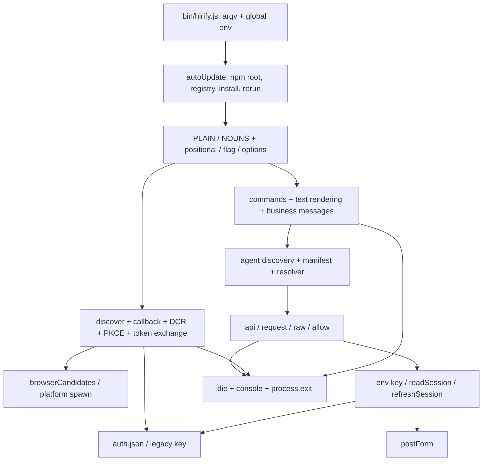
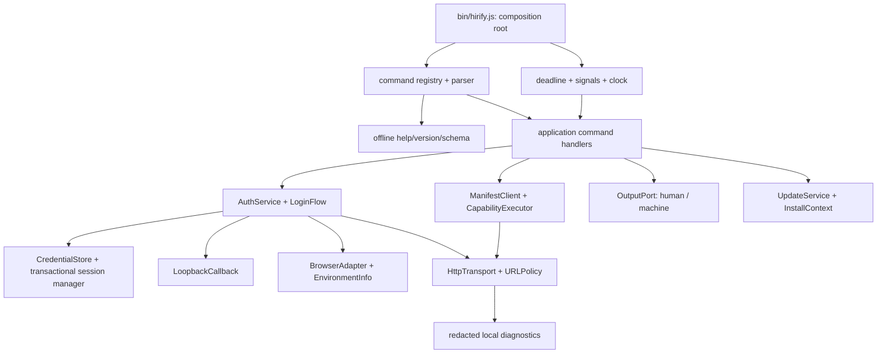

# Архитектурный и кодовый аудит Hirify CLI

Дата: 17.09.2026. Объект: пользовательский CLI для людей и AI-агентов. Код продукта не изменялся. Документ внутренний, не предназначен для npm или skills.sh. Размещение выбрано по назначению документа после уточнения оператора.

Кратко: 30 findings объединяют подтвержденные дефекты и отдельно отмеченные риски. Основной объект - опубликованный `hirify-cli@0.4.7`; локальная ветка и кандидат browser fix проверены отдельно. После первого прохода выполнена критика собственных выводов и десять дополнительных проверок. План ограничен исправлением клиентских контрактов; device flow, keychain, несколько профилей и смена updater policy не являются условиями первого рефакторинга.

Содержание: [оценка](#1-оценка-состояния), [источники и метод](#2-что-именно-проверено-и-где-источник-истины), [текущая архитектура](#3-карта-текущей-архитектуры-и-потоков), [findings](#4-шкала-и-реестр-findings), [предыдущее расследование](#5-проверка-исходного-расследования), [целевая архитектура](#6-целевая-архитектура), [миграция](#7-план-миграции-и-порядок-изменений), [проверки](#8-test-matrix-и-acceptance-criteria-рефакторинга), [rollback](#9-миграционные-риски-и-rollback-strategy), [что сохранить](#10-что-не-требует-изменения), [продуктовые решения](#11-открытые-решения-требующие-продуктового-выбора), [воспроизведение](#12-воспроизведение-и-проверка-доказательств), [источники](#13-первичные-источники-и-применимость), [критический проход](#14-критическая-перепроверка-и-окончательный-объем).

## 1. Оценка состояния

CLI реализует полезный продуктовый контракт: команды поиска и отклика, единый Agent API, серверный каталог возможностей, браузерный OAuth с PKCE, машиночитаемые успешные ответы и инструкции агенту. Это рабочая основа, которую следует сохранить. Однако инфраструктура CLI пока не обеспечивает предсказуемость production-продукта на разных ОС, в параллельных процессах и при частичных отказах.

Проблема шире Windows browser launch. Основные системные причины: невыраженные границы доверия к URL и credentials; глобальное изменяемое состояние без транзакций; собственный неоднозначный парсер; смешение HTTP-успеха с продуктовым успехом; обновление программы перед любой командой; тесты преимущественно на ответы Agent API, а не на жизненный цикл установленного CLI.

На локальных заглушках подтверждены, в частности:

- `logout --help` удаляет сохраненный вход, `auth --help <key>` сохраняет ключ.
- `vacancy search --limit=2 golang` теряет поисковую фразу; `vacancy apply demo --cover --json` отправляет `--json` как сопроводительное письмо.
- HTTP 201 с HTML вместо JSON приводит к `Applied. Status sent.` и exit 0.
- Сохраненный OAuth-токен отправляется другому `HIRIFY_API`; произвольный `manifest_url` получает Bearer; HTTP 307 от token endpoint переносит refresh token в тело запроса к другому origin.
- Два CLI одновременно обновляют один rotating refresh token; завершение refresh после `logout` восстанавливает удаленную сессию.
- Callback с `error=access_denied`, но без `state`, завершает чужой ожидающий вход.
- Успешное сохранение входа с последующим отказом account API заканчивается exit 1.

Это доказательства поведения клиента в контролируемых условиях, не свидетельства эксплуатации или массовых инцидентов на проде. Частота реальных отказов неизвестна: соответствующих метрик нет в исследованном коде, серверные журналы в этом аудите не читались.

Рекомендация: один согласованный рефакторинг, выполненный последовательностью небольших проверяемых изменений на базе публичной истории. Сначала зафиксировать инварианты и регрессии, затем разделить ответственность, мигрировать состояние и выпускать точный проверенный артефакт. Простое разнесение существующих функций по файлам проблемы не решит.

## 2. Что именно проверено и где источник истины

### 2.1. Зафиксированные состояния

| Обозначение | Состояние | Значение для аудита |
|---|---|---|
| L | Рабочее дерево `release/agent-access-refactor`, HEAD `093a3e757cd24d994fbce469835b40946353a729` | `package.json`: `hirify@0.4.0`; 1666 строк основного файла. Ветка не является источником опубликованной версии. |
| P | Публичный `origin/main` после fetch: `fce36993a7a7b23d8fcc7fa5c59b40d5ca1e495f` | `hirify-cli@0.4.7`; 1884 строки `bin/hirify.js`, 13 строк `bin/open-browser.js`. Основной объект findings. |
| N | npm `hirify-cli@0.4.7`, dist-tag `latest` на момент фиксации | Скачан tarball; все 8 его файлов побайтно совпали с P, SHA-512 совпал с registry integrity. |
| C | Незакоммиченные изменения `/tmp/wt-winlaunch` относительно P, снимок около 11:32 +04 | Кандидат `0.4.8`, `open:^10.2.0`, новая проверка среды, ссылка до запуска, обработка exit, `shell:true` для npm на Windows. Не объявляется опубликованным. |

Имя npm-пакета **`hirify-cli` правильно**: оператор подтвердил, что npm не разрешил регистрацию `hirify`. Исполняемая команда **`hirify` правильно** задана в `bin`. Менять или унифицировать эти два имени не требуется. Дефектом является устаревшее имя в L и вероятность выпуска из неверного дерева, а не выбранное имя пакета.

N integrity: `sha512-m3cvqdKgiZ6+nKupG9+3KlAKGd0MapfX8z4WJvCdt1L+VcgTPRJy5wexbauVY6DNX8MC0iN0Z/xVG5TJJVIfOw==`.

Снимок C закреплен SHA-256 файлов, поскольку commit у него отсутствовал:

| Файл C | SHA-256 |
|---|---|
| `bin/hirify.js` | `e4393b09bfb762a6f8e6c69084f47f936bdc23bffe5cd4f5c9320d055729ba1b` |
| `bin/open-browser.js` | `0a320961d516a2bf99cf76ff3da8730d86be8acce549a97ee88bc18c33435426` |
| `package.json` | `cfaf7e61ff23433a3dede345ec4ac5ccc3bb7c642cb2f59e0e717d99675796e7` |

Все ссылки P ниже закреплены полным SHA, а не плавающим `main`. Номера строк относятся к P, если явно не указано C или L. Снимок C доступен в архиве доказательств, поэтому последующие изменения соседней вкладки не меняют предмет вывода.

### 2.2. Метод и ограничения

Прочитаны целиком два runtime-файла P, `scripts/test.mjs`, `scripts/prepublish-check.mjs`, `package.json`, README, оба файла skill; исследованы отличия L от P, весь diff C, существующие acceptance-спецификации и релевантное исследование упаковки skill. Проверены tracked tree, корни истории, теги, npm metadata, содержимое tarball и дерево зависимостей C. Проверка публичных well-known ограничена двумя анонимными GET.

Среда исполнения: Linux, Node `v22.22.1`, npm `10.9.8`. На P прошли **96/96** штатных тестов. На изолированном снимке C после установки зависимостей с `--ignore-scripts` прошли **97/97**. Дополнительно выполнены **20 диагностических сценариев** на P и C: отдельные процессы CLI, локальные HTTP-серверы, временный `XDG_CONFIG_HOME`, только синтетические токены, автообновление выключено. Это пробы наблюдаемого поведения, не утверждение о 20 независимых дефектах. В обеих версиях воспроизведенные системные проблемы сохранились.

Архив автора: `/home/igora/hirify-qa/2026-09-17-hirify-cli-architecture-audit-author/`. В нем `public/`, `candidate/`, `package.tgz`, `probes.mjs`, `probe-results.json`, `candidate-probe-results.json`, логи штатных тестов, dependency tree, npm audit и ответы публичного discovery. После критического прохода добавлены `critique-probes.mjs` и `critique-results.json` с семью дополнительными проверками P, а также `tls-probes.mjs`/`tls-results.json` с тремя TLS/proxy проверками (§14). Авторские пробы не заменяют независимую приёмку документа.

Не проверены исполнением: Windows, macOS, WSL, реальные браузеры и user consent, Windows ACL, keychain, реальный корпоративный HTTPS proxy/CA (локальные TLS/CA и proxy bypass проверены), production refresh rotation, сбой диска/питания, реальное самообновление глобальной установки. Их точные проверки заданы ниже. Не использованы реальные credentials, не выполнялись реальные apply/reveal/feed mutations, login/register на проде, публикация или обновление установленного пользовательского CLI.

Исследование источников начато через `deep-research`: 50 источников, 34 прочитанных страницы, 8 агрегированных утверждений, из них 5 лишь частично подтверждены. Его выводы не приняты автоматически: для значимых сравнений отдельно прочитаны официальные RFC, документация продуктов и открытый код. Блоги и проекты стандартов не используются как нормативное основание. Claude Code и Codex не исследовались подробно: применимые решения подтверждены GitHub CLI, AWS CLI, gcloud, Azure CLI, Node и npm; сравнений с неоткрытой реализацией здесь нет.

### 2.3. Публичный сервер на момент проверки

Анонимный [OAuth discovery](https://api.hirify.me/.well-known/oauth-authorization-server) объявлял issuer `https://api.hirify.me`, code + refresh grants, PKCE S256, public client authentication `none`, registration endpoint и шесть ожидаемых scopes. Device authorization endpoint не объявлен. Это доказывает отсутствие объявленной поддержки device flow, но не доказывает отсутствие любой скрытой реализации.

[Agent discovery](https://api.hirify.me/.well-known/hirify-agent) возвращал `schema_version:1`, manifest URL и OpenAPI URL на том же origin. `intro` отсутствовал. Актуальный authenticated manifest и серверная реализация прав/дедупликации не читались; соответствующие свойства не приписываются серверу по клиентским комментариям.

## 3. Карта текущей архитектуры и потоков



**Запуск:** импорты и чтение package version -> вычисление глобальных API/config paths -> обязательный `await autoUpdate()` -> маршрутизация -> команда. Поэтому даже help/version/logout зависят от логики установки и обновления ([P:143-201][p-update], [P:1861-1884][p-router]).

**Обычная команда:** public discovery -> получение access token, возможно refresh -> authenticated manifest -> поиск capability -> сборка path/query/body -> authenticated API, возможно второй refresh на 401 -> индивидуальная интерпретация статусов -> текст или JSON. Для `api call` capability разрешается дважды; между чтением input mapping и отправкой допускается новый manifest ([P:588-691][p-manifest], [P:1734-1803][p-generic]).

**Login:** discovery -> listener на `127.0.0.1:0` -> новая динамическая регистрация клиента с точным port -> генерация verifier/state -> OAuth URL -> browser launch -> ожидание callback максимум 5 минут только на этой стадии -> закрытие listener -> обработка error/state/code -> обмен -> запись credentials -> запрос account summary. Token exchange и предшествующие HTTP-запросы не покрыты этим пятиминутным таймером ([P:838-977][p-login]).

**Состояние:** `HIRIFY_KEY` приоритетнее одного `auth.json`; при ошибке чтения JSON возможен fallback на старый файл `key`. Все серверы/аккаунты используют один путь. Refresh обновляет этот же файл обычным overwrite; logout удаляет его. Блокировок, generation/version, атомарной замены и проверки issuer нет ([P:365-415][p-state], [P:983-1013][p-refresh]).

**Изоляция:** единственный выделенный runtime-модуль P формирует команды браузера; C расширяет его, но оставляет env, transport, OAuth, store, updater, presentation и routing в одном executable. Импортировать основной файл как библиотеку нельзя без исполнения маршрутизатора. `die` доступен любому слою и немедленно завершает процесс.

## 4. Шкала и реестр findings

P0 - немедленный широкий компромисс или потеря данных; **подтвержденных P0 нет**. P1 - утечка credentials при описанных условиях, неверная необратимая операция, массовая недоступность или опасный выпуск. P2 - существенная надежность, поддержка, совместимость или архитектурный риск. P3 - ограниченное неудобство. Приоритет не является CVSS.

Вероятность: высокая/средняя/низкая при указанном сценарии, без придуманной статистики пользователей. Confidence: высокая означает прямое доказательство кодом или пробой; средняя означает платформенную/серверную часть, требующую проверки. Blast radius - область затронутых пользователей или операций. «Дефект» означает подтвержденное свойство клиента, «риск» - условное последствие или отсутствующую гарантию. Платформы: **ALL** = Windows/macOS/Linux, **REMOTE** = SSH/container/CI; WSL рассматривается отдельно от native Linux.

### F01. Credentials не привязаны к выбранному серверу

- **Статус и оценка:** дефект; P1; вероятность средняя при переключении окружений; confidence высокая; blast radius - все полномочия сохраненного аккаунта.
- **Доказательство:** `API` берется из env, `readSession/accessToken` не сравнивают issuer; issuer только записывается при login ([P:22-33][p-config], [365-415][p-state], [958-967][p-save]). Проба `issuer_mismatch_reuses_saved_token`: сессия с issuer `https://production.example` отправлена на локальный иной origin.
- **Сценарий:** пользователь тестирует другой API через `HIRIFY_API`, а CLI молча посылает production credential. Это не доказывает удаленную эксплуатацию без контроля конфигурации.
- **Практика и цель:** host-scoped auth у [GitHub CLI][s-gh-auth]; проверка issuer в [RFC 8414 §3.3][s-discovery]. Разделить trusted API profile и credential identity; выдавать credential только точному нормализованному origin/issuer. Legacy key без issuer мигрировать в production profile, не назначать текущему произвольному override.
- **Тесты:** ALL, матрица prod/staging/local, другой scheme/port, userinfo, trailing slash, env key vs stored; при несовпадении до отправки секрета - ошибка, никакого Bearer на чужом сервере.

### F02. Discovery, manifest URL и redirect HTTP не имеют политики доверия

- **Статус и оценка:** подтвержденное отсутствие проверок и передачи в пробах; P1; вероятность низкая при штатном HTTPS discovery, выше при override/ошибке metadata; confidence высокая для клиента; blast radius - access/refresh tokens.
- **Доказательство:** OAuth metadata принимается без issuer/type/scheme validation ([P:699-739][p-discovery]); `manifest_url` получает Bearer без ограничения origin ([P:559-635][p-manifest]); все fetch используют default redirect. Пробы `manifest_cross_origin_receives_token` и `refresh_307_forwards_secret_body` подтвердили передачу синтетических секретов другому local origin. `request` склеивает `${API}${path}`, не проверяя, что path остается относительным ([P:421-429][p-http]).
- **Сценарий:** неправильный discovery отправляет token на telemetry/CDN URL; token endpoint с 307 переносит refresh body. Обычная проверка TLS сертификата остается включенной; это не утверждение о MITM штатного prod или автоматическом переносе Authorization через любой redirect.
- **Практика и цель:** [RFC 8414][s-discovery], [OAuth Security BCP][s-security], URL scheme validation в [GitHub authflow][s-gh-code]. Центральный URLPolicy: production HTTPS, trusted issuer/endpoints, явные допустимые разные origins при необходимости; секретные POST без автоматических redirect; manifest same-origin по умолчанию; path начинается с одного `/`, итоговый origin повторно проверяется; browser URL только допустимый HTTPS. HTTP loopback разрешать для callback и явно включенного локального тестового профиля.
- **Тесты:** ALL: чужой issuer, `http:`, `file:`, userinfo, protocol-relative/path tricks, 301/302/303/307/308, cross-origin token body, invalid JSON metadata. Ни один секрет не должен достигать запрещенного origin. C с `open` не снимает обязанность проверять URL; base64 команды не является санитаризацией входа.

### F03. Callback завершает попытку до проверки state

- **Статус и оценка:** дефект; P2; вероятность низкая/средняя при постороннем callback; confidence высокая; blast radius - одна попытка входа.
- **Доказательство:** первый запрос на `/callback` вызывает settle, независимо от method и state; HTML отправляется до валидации. После этого listener закрывается; OAuth error обрабатывается раньше state ([P:746-788][p-callback], [910-940][p-answer]). Проба без state с `access_denied` дала HTTP 200 и сообщение про отсутствие доступа аккаунта. Дополнительная проба с request target `http://[` завершила процесс непойманным `ERR_INVALID_URL` на строке 751, exit 1.
- **Сценарий:** случайный переход, сканер localhost или другой локальный процесс срывает login; чужое сообщение выдается за отказ Hirify. Захват токена этим сценарием не доказан: PKCE защищает обмен.
- **Практика и цель:** request/response correlation по [RFC 8252 §8.9][s-native]. Listener получает expected state до начала взаимодействия; проверяет method, path, Host/authority, единственность параметров, state на success и error. Невалидный запрос отвечает 4xx и не завершает попытку. Только валидный callback вызывает settle один раз; запрещенные URL не должны бросать непойманное исключение.
- **Тесты:** ALL: wrong/missing/duplicate state, wrong method/path/Host, malformed target, error без state, replay, два callbacks; после мусорного callback корректный завершает login. Политика Host не должна требовать browser Origin для обычной top-level navigation.

### F04. `--no-browser` не решает remote OAuth

- **Статус и оценка:** подтвержденное ограничение browser flow; P2, не уязвимость и не полный отказ unattended CLI: env key уже работает; вероятность высокая при браузере на другой машине; confidence высокая; blast radius - remote пользователи без API key или tunnel.
- **Доказательство:** redirect всегда `127.0.0.1` в namespace CLI ([P:853-897][p-login]); `--no-browser` лишь подавляет запуск. C `open-browser.js:24-30` определяет TTY/SSH/display, но протокол не меняет. Device flow в коде отсутствует и live discovery его не объявляет.
- **Сценарий:** CLI на сервере, браузер на ноутбуке: браузер обращается к localhost ноутбука. В контейнере localhost callback может быть недоступен даже браузеру на том же физическом компьютере. Печатать ссылку недостаточно.
- **Практика и цель:** [AWS CLI][s-aws-login] разделяет same-device PKCE и device code; [Azure CLI][s-azure-login] имеет явный device mode; [gcloud][s-gcloud-login] предлагает remote bootstrap. Цель: local loopback PKCE плюс отдельный RFC 8628 device flow при серверной поддержке, и env/stdin key для unattended. До него - честный fail-fast/выбор API key либо точно описанный SSH tunnel с фиксируемым callback port; не обещать универсальный remote login.
- **Тесты:** REMOTE + ALL desktop: физически разные browser/CLI hosts, отдельный network namespace, tunnel, отсутствие дисплея, redirected stdout. Для device: pending/slow_down/denied/expired/cancel, истечение device code и интервалы polling по [RFC 8628][s-device].

### F05. Хранилище не гарантирует приватность и целостность записи

- **Статус и оценка:** дефект POSIX-поведения и риск Windows ACL/сбоев; P1 при небезопасных правах; вероятность средняя при существующем файле; confidence высокая на POSIX, средняя на Windows; blast radius - credentials одного пользователя.
- **Доказательство:** `mkdirSync` без mode, `writeFileSync` прямо в конечный путь с `mode:0600`, нет chmod/lstat/atomic replace ([P:381-384][p-state]). Проба `existing_file_mode_not_repaired` оставила `0644` после записи нового ключа. Mode применяется при создании, не исправляет существующий файл. Symlink и прерывание overwrite статически не обработаны.
- **Сценарий:** старый или восстановленный из backup файл доступен другим локальным пользователям; авария оставляет усеченный JSON и заставляет снова входить. Windows `0600` нельзя считать доказательством ограниченного DACL.
- **Практика и цель:** [GitHub CLI][s-gh-auth] использует системное credential store с fallback; семантика записи - [Node fs][s-node-fs]. Для первого рефакторинга достаточно надежного private-file store на прежнем пути: приватный каталог, проверка владельца/прав, запрет нежелательных symlink, temporary file + flush/rename, Windows DACL/replace semantics. OS keychain - отдельное последующее решение, не обязательная зависимость исправления. Не пытаться «шифровать» ключом в соседнем файле.
- **Тесты:** Linux/macOS permissions/umask/symlink/disk-full/kill; Windows ACL чужого пользователя, roaming profile и atomic replacement при открытом файле; secure store locked/unavailable. После сбоя остается старая или новая целая запись, а не половина JSON.

### F06. Нет межпроцессной транзакции refresh/login/logout

- **Статус и оценка:** дефект; P1; вероятность высокая при параллельной работе агента возле expiry; confidence высокая для клиента; blast radius - все процессы одного auth profile.
- **Доказательство:** read -> HTTP refresh -> overwrite без lock/re-read/generation ([P:405-415][p-state], [983-1006][p-refresh]); logout лишь rm. Пробы подтвердили два refresh с одинаковым token, один invalid_grant, и восстановление auth.json после logout.
- **Сценарий:** агент параллельно читает feed/account, rotating token используется дважды. Сервер может отклонить второй запрос; аннулирование всей token family зависит от сервера и здесь не доказано. Login другого аккаунта и поздний refresh также могут перезаписать друг друга.
- **Практика и цель:** rotation предполагается [RFC 9700 §4.14][s-security]; serialization - инженерное следствие, не предписанный RFC тип lock. Межпроцессный lock на credential identity, повторное чтение после захвата, generation/CAS при commit, logout tombstone/смена generation. Lock включает refresh transaction, но не пять минут ожидания браузера. При ambiguous refresh result не повторять старый token вслепую.
- **Тесты:** ALL, 10-20 параллельных процессов нового протокола, rotation, задержанные ответы, crash владельца lock, stale lock, logout/login во время refresh. Один refresh для одной generation; logout нельзя отменить запоздалой записью. Keychain сам по себе эту гонку не исправляет. Смешанный запуск с 0.4.7 проверяется как ограничение миграции, см. §6.1.

### F07. Состояния авторизации и частичного успеха смешаны

- **Статус и оценка:** дефект; P2; вероятность средняя; confidence высокая; blast radius - повторный вход и восстановление сессии.
- **Доказательство:** `login` при любом OAuth state пытается использовать его и советует `--force`; ошибка refresh всегда требует `login`, который снова идет в тот же fast path ([P:838-850][p-login], [983-995][p-refresh]). После успешной записи `cmdAccountShow` обернут в catch, но `die` вызывает process.exit и catch его не ловит ([P:969-975][p-save], [120][p-update]). Проба `valid_login_followup_failure_exits_one`: auth сохранен, exit 1. `HIRIFY_KEY` сохраняет приоритет даже после нового browser login.
- **Сценарий:** revoked refresh -> пользователь повторяет рекомендованный login -> тот же отказ; либо успешно вошел, account API недоступен, автоматизация считает вход неуспешным. При заданном env key summary относится к env identity, а не только что сохраненному OAuth.
- **Практика и цель:** typed auth states и локальная status-команда по образцу [gh auth status/login][s-gh-auth]; reauth через явный переход, а не пересоздание всего процесса из функции ошибки. Разделить session validity, refresh failure, interactive reauth, сохранение и необязательный summary. При env override показывать источник identity, не раскрывая token. Не открывать браузер автоматически после ошибки обычной agent-команды.
- **Тесты:** ALL: revoked/expired/missing refresh, transient 503 vs invalid_grant, `login --force`, env key + OAuth, account failure после сохранения. Успешный login имеет предсказуемый exit независимо от необязательного summary.

### F08. OAuth response и scopes принимаются слишком свободно

- **Статус и оценка:** дефект валидации и риск будущего расширения scopes; P2; вероятность низкая/средняя; confidence высокая; blast radius - все новые/обновляемые сессии.
- **Доказательство:** `scopes_supported` целиком становится запросом; token success проверяет только truthy `access_token`, `expires_in` преобразуется Number без bounds, token_type не проверяется ([P:699-719][p-discovery], [943-967][p-save], [994-1004][p-refresh]). Сессионная схема проверяет только непустой string access_token. Использование requested scope при отсутствии scope в ответе само по себе допустимо по RFC6749 при неизменных правах; отдельным дефектом не считается.
- **Сценарий:** issuer публикует scopes для нескольких клиентов, CLI просит все; malformed token response дает бессрочное/необновляемое состояние или неверное объяснение прав. Live discovery сегодня содержал только шесть ожидаемых scopes: избыточный доступ сейчас не доказан.
- **Практика и цель:** [RFC 6749 §5.1/§6][s-oauth], [RFC 8414][s-discovery]. Схема token/session, допустимый Bearer type, положительный конечный expiry, когда он присутствует (отсутствующий optional expiry требует явной поддержанной политики), отдельные requested/granted scopes и client-specific scope policy. Можно иметь серверный CLI scope profile; нельзя отождествлять все поддерживаемые сервером права с необходимыми CLI.
- **Тесты:** ALL: access token object/empty, malformed/negative/zero expiry, unknown token type, отсутствие optional refresh, измененный granted scope, scope для другого продукта. Не терять valid old session до подтвержденного commit новой.

### F09. Новая динамическая регистрация на каждый login не является необходимостью PKCE

- **Статус и оценка:** подтвержденная архитектура, риск доступности/накопления; P2; вероятность средняя при повторах; confidence высокая для CLI, средняя для серверных последствий; blast radius - новые входы и registration service.
- **Доказательство:** comment связывает регистрацию с новым портом, POST выполняется каждый раз ([P:865-883][p-login]). Нет сохраненного registration record или reuse. Данные о cleanup/лимитах сервера отсутствуют.
- **Сценарий:** отказ registration API блокирует login, повторные попытки создают новые clients. Накопление в БД и размер эффекта требуют серверных измерений.
- **Практика и цель:** [RFC 8252 §7.3][s-native] допускает переменный port зарегистрированного loopback redirect. Для first-party CLI предпочесть стабильный public client ID с корректной серверной проверкой loopback/path; client ID не secret. Если DCR необходим другим клиентам, сохранять валидную регистрацию и ее жизненный цикл отдельно от попытки входа. Решение согласовать с сервером, не менять client model одним CLI-коммитом.
- **Тесты:** ALL + auth server: несколько ephemeral ports, exact path/host match, IPv4/IPv6, невозможность redirect наружу, register unavailable, повторные входы. Не объявлять сервер нарушающим RFC по одному клиентскому комментарию.

### F10. Browser integration: опубликованная версия ошибочна, кандидат закрывает лишь часть контракта

- **Статус и оценка:** подтвержденный дефект проверки результата P; Windows failure из входного расследования, не воспроизведен здесь; P1 для Windows login; вероятность высокая в заявленном инциденте; confidence высокая по коду, средняя по ОС; blast radius - Windows и headless login.
- **Доказательство:** P выбирает `explorer.exe`, успех определяется событием `spawn`, nonzero exit игнорируется ([P open-browser:8-12][p-browser], [819-835][p-browser-call]). C передает запуск `open`; `canOpenBrowser` использует TTY/SSH/display; timer через 3 секунды считает еще живой launcher успехом (C `open-browser.js:24-58`). В C остаются `Opening Hirify in your browser` до результата и README `Your browser opens`.
- **Сценарий:** launcher запущен, но страницу не открыл; GUI отсутствует/PowerShell запрещен политикой. WSL без DISPLAY может иметь рабочий Windows browser, но heuristic C запрещает попытку. Явный custom `BROWSER`, который P учитывал на всех ОС, C больше не передает в adapter; Linux xdg-open может отдельно учитывать унаследованный BROWSER, это требует проверки. Container с display нельзя считать безбраузерным автоматически.
- **Практика и цель:** [open v10.2.0][s-open] решает quoting/platform mechanics; [GitHub authflow][s-gh-code] разделяет interactive mode, URL и ошибку launcher. Оставить библиотеку за небольшим adapter, вернуть структурированные `skipped/requested/failed/unknown` и reason, считать только валидный callback подтверждением OAuth. Детектор среды - подсказка, явный browser mode имеет приоритет; определить политику BROWSER и WSL. Никакой собственный список Windows shell-рецептов.
- **Тесты:** native Windows cmd/PowerShell, macOS open, Linux X11/Wayland, WSL, REMOTE, custom browser, отсутствующий executable, exit 1, зависший launcher. Проверять получение полного URL тестовым browser handler на ОС и отдельно реальный default browser, а не строку аргументов на Linux.

### F11. Нет единого deadline, cancellation и cleanup

- **Статус и оценка:** дефект application-level lifecycle; P1 для unattended команд; вероятность средняя; confidence высокая; blast radius - все сетевые команды.
- **Доказательство:** request/discovery/token/register не получают AbortSignal ([P:421-432][p-http], [559-575][p-manifest], [699-739][p-discovery], [869-883][p-login]); login timer начинается лишь после registration/browser; listener close не ожидается и закрывает только idle connections ([P:784-787][p-callback]). Process signal handlers отсутствуют, `die` обходит finally в других слоях. Проба blackhole discovery принудительно остановлена через 1.7 с без ответа; это не замер бесконечного ожидания: underlying fetch имеет собственные таймауты.
- **Сценарий:** сеть приняла соединение и не отвечает; `intro` не доходит до offline fallback; агент ждет значительно дольше своего budget. Прерывание во время refresh/write/update оставляет неопределенный результат. ОС закрывает сокеты умершего процесса, поэтому утверждать вечную утечку callback port после SIGINT нельзя.
- **Дополнительное доказательство:** незавершенные HTTP headers на отдельном callback socket удержали процесс после valid PKCE, сохранения auth и полного success output; потребовался внешний SIGKILL через 2.2 секунды. Контроль без этого socket завершился exit 0. Это задержка cleanup, не доказательство бесконечного зависания. [Node HTTP][s-node-http] различает idle и active connections.
- **Практика и цель:** единый command context с AbortController, общий deadline плюс phase budgets, typed cancellation, cleanup в finally; завершение из entrypoint, а не transport ([Node process][s-process]). Listener ограничивает размер/время запросов, закрывает активные callback sockets после bounded grace. SIGINT/SIGTERM отменяют HTTP и owned launcher, не убивают весь пользовательский браузер.
- **Тесты:** ALL, SIGINT на каждой стадии, Windows Ctrl+C отдельно, SIGTERM POSIX/container, slow headers/body, зависший register/token, active callback socket, EPIPE pipeline. Проверять время завершения, закрытый port, состояние файла и отсутствие orphan child.

### F12. Help имеет побочные эффекты

- **Статус и оценка:** дефект; P1; вероятность средняя, особенно у исследующего интерфейс агента; confidence высокая; blast radius - локальный вход, регистрация и глобальная установка.
- **Доказательство:** help до dispatch обрабатывает лишь top-level noun, вложенный help только NOUNS; PLAIN сразу исполняет handler ([P:1861-1881][p-router]). Пробы `help_logout_mutates`, `help_auth_mutates`; `login --help` по тому же коду начинает flow. AutoUpdate вызывается еще раньше любого help.
- **Сценарий:** пользователь хочет справку и выходит из аккаунта; агент спрашивает login help и получает listener/registration/browser. Top-level help глобальной установки может начать npm install.
- **Практика и цель:** side-effect-free command parsing/help - контракт зрелых CLI; [gcloud login reference][s-gcloud-login] документирует отдельные flags. Сначала parse/validate/resolve help, затем построение application context и effects. Все `-h/--help` и version работают offline и без записи.
- **Тесты:** ALL, каждый путь из command registry с `--help/-h`, отсутствующими/лишними аргументами. Assert ноль HTTP, subprocess browser/npm, изменений store. Не достаточно assert «нет unknown command», как сейчас в [P tests:900-913][p-test-help].

### F13. Парсер не задает однозначную грамматику и может изменить реальные данные

- **Статус и оценка:** дефект; P1 из-за apply payload; вероятность средняя; confidence высокая; blast radius - search, feed, feedback, apply, generic calls.
- **Доказательство:** `positional` для `--name=value` все равно может съесть следующий token; `flag` без проверки берет следующее значение даже если это другой flag; `--` не завершает parsing ([P:211-264][p-parser]). Пробы подтвердили потерю `golang`, потерю слова после `--`, письмо `--json`. Конфликтующие delivery flags имеют разные приоритеты create/deliver ([P:1448-1482][p-feeds]); неизвестные flags curated-команд и лишние positionals часто игнорируются.
- **Сценарий:** опечатка в `--filters` создает feed со всеми вакансиями; missing value превращается в письмо; поиск отличается от запроса пользователя без ошибки. `--json account show` не поддерживается как глобальный flag, хотя агент может ожидать такое поведение.
- **Практика и цель:** декларативная схема команд, типов, arity и конфликтов; один parse result для handler и rendering. Сохранить extensible search filters через явно ограниченный passthrough только команды search, не через угадывание всех опций. `--`, `--x=y`, empty values, repeated options должны иметь задокументированную семантику. Schema-driven parsing может опираться на зрелую библиотеку; конкретную зависимость выбирать по контрактным тестам.
- **Тесты:** ALL, cmd/PowerShell/POSIX quoting, option permutations, equals/space, unknown/missing/duplicate/conflicting, Unicode, значения с `-`, safe integer IDs. Невалидный input не вызывает сеть и не делает mutation.

### F14. Неверный или неполный success body выдается за успешную операцию

- **Статус и оценка:** дефект; P1; вероятность средняя при proxy/server contract failure; confidence высокая; blast radius - все команды, особенно apply/feed/webhook.
- **Доказательство:** `res.json().catch(()=>null)`, `res.ok` достаточно; `allow` возвращает status wrapper только для перечисленных кодов, другие 2xx получают иную форму ([P:487-542][p-http]); handlers заполняют отсутствующие поля успешными defaults ([P:1392-1424][p-apply], [1457-1465][p-feeds], [1518-1534][p-webhooks]). Проба 201 HTML дала `Applied. Status sent.`; 200 HTML при feed list --json дал `null` и exit 0.
- **Сценарий:** пользователь уверен в отправленном отклике, хотя клиент не смог прочитать подтверждение. После частичного серверного выполнения повтор может быть опасен.
- **Практика и цель:** отделить HTTP response, validated envelope и domain result; успех требует ожидаемого status и минимальной схемы данных. Не копировать все optional fields API, но проверять обязательные invariants, Content-Type/JSON, `ok:false`, identity результата. Для mutation с неопределенным результатом - outcome unknown, не invented success и не «ничего не отправлено».
- **Тесты:** ALL: 200/201/202/204 по спецификации каждой capability, HTML, broken JSON, null, неправильный data type, отсутствующий application ID, ok:false, response truncated. Любой недоказанный mutation result не должен иметь success text/exit 0. Нормативная база статусов - [HTTP semantics][s-http]; конкретная схема согласуется с Agent API.

### F15. Машинный контракт ошибок и вывода неоднороден

- **Статус и оценка:** дефект документации/интерфейса; P2; вероятность высокая в agent-driven работе; confidence высокая; blast radius - все automation consumers.
- **Доказательство:** `--json` учитывается в `out`, но не во всех PLAIN-командах; curated errors вызывают текстовый die, generic errors печатают body в stdout, даже HTML ([P:274-283][p-output], [1787-1802][p-generic], [1009-1016][p-refresh]). README обещает JSON для любой команды ([P README:61-67][p-readme]); login смешивает progress и account JSON. Проба named 403 --json дала пустой stdout и prose stderr. Непойманные исключения могут печатать stack без `hirify:`.
- **Сценарий:** один и тот же клиентский wrapper не может разобрать ошибку без поиска слов; `--json` не гарантирует JSON. Дополнительная проба raw 400 с JSON 2 MiB подтвердила обрезание pipe: 146176 из ожидаемых 2097216 байтов, invalid JSON, exit 1 ([P:1787-1802][p-generic], [Node process][s-process]). Конкретное число зависит от buffering; дефект - принудительный exit до завершения вывода.
- **Практика и цель:** единый renderer, structured error codes, status/retryable/request_id/action, progress только stderr. Сохранить `0/1/2` и существующие API success envelopes; не оборачивать все `--json` ответы новой схемой. В первом рефакторинге добавить opt-in `--error-format=json` для stderr и документировать legacy errors; отдельный формат всех успешных ответов не нужен. OS signal exits документировать отдельно. Только entrypoint задает exitCode после завершения вывода.
- **Тесты:** ALL: JSON parser на success/error/empty/non-JSON transport для каждой команды; stdout/stderr snapshots, pipe/backpressure/EPIPE; совместимость существующих consumers. Коды причин расширять внутри JSON, не переопределять exit 2 как usage error.

### F16. Диагностика недостаточна, raw debug не имеет redaction

- **Статус и оценка:** подтвержденный пробел; утечка через debug является риском, не наблюденным prod-инцидентом; P2; вероятность высокая для обращения в поддержку; confidence высокая; blast radius - диагностика всех клиентов и данные одного bug report.
- **Доказательство:** HIRIFY_DEBUG печатает целые server bodies и error_description ([P:533-535][p-http], [927][p-answer], [1348][p-feedback]); updater catch скрывает причину. Нет request IDs, phase timings, launcher reason codes, auth status/doctor. README прямо советует приложить raw reply. API key вводится аргументом argv ([P:1539-1547][p-webhooks], [README:43-45][p-readme]).
- **Сценарий:** support не отличает proxy от DNS/timeout/blocked browser; key попадает в shell history/видимый argv/agent transcript; сервер может отразить в ошибке PII или secret. Намеренный одноразовый webhook secret - продуктовый ответ, не случайный debug leak.
- **Практика и цель:** [gh auth login --with-token][s-gh-auth] читает stdin. Добавить stdin/file-descriptor ввод, `auth status`, `doctor`, локальный bounded diagnostic bundle с allowlist полей и redaction; ошибки browser/network/update имеют коды. Не собирать remote telemetry скрытно. Runtime диагностика исключает tokens, PKCE verifier, code, полные auth URLs, письма/поисковые запросы и webhook secret. User-Agent/version и server request ID достаточны для базовой корреляции.
- **Тесты:** ALL: planted canary secrets во всех ошибках, nested bodies, URLs, proxy credentials, filesystem paths; diagnostic export не содержит canaries. Отдельно проверить shell history/argv отсутствие ключа при новом recommended flow. Политика удаленной telemetry - открытое продуктовое решение.

### F17. Proxy/TLS поведение зависит от версии Node и окружения, не от контракта CLI

- **Статус и оценка:** подтвержденный пробел и proxy bypass в локальной пробе; P1 для обязательного corporate proxy; вероятность высокая в таких сетях; confidence высокая в проверенной среде, средняя для всей матрицы; blast radius - corporate/CI пользователи.
- **Доказательство:** все HTTP через global fetch без dispatcher/config ([P:425][p-http], [603][p-manifest], [707-734][p-discovery]); package поддерживает `>=18`. Проба с HTTP_PROXY/NO_PROXY на Node22 default: proxy получил 0 запросов, API - прямые. Дополнительная HTTPS-проба с доверенным synthetic CA также пошла напрямую: API получил 1 request, HTTPS_PROXY - 0. Недоверенный self-signed certificate дал 0 API requests; NODE_EXTRA_CA_CERTS разрешил запрос. Это подтверждает штатную TLS verification и рабочий базовый custom CA, но не работу CONNECT/authenticated proxy, которая отдельно не исполнялась.
- **Сценарий:** npm install проходит через настроенный npm proxy, а CLI login/search не проходят или обходят ожидаемый proxy. Ошибка доверия корпоративному CA описывается как «network unavailable».
- **Практика и цель:** [AWS proxy docs][s-aws-proxy] явно определяют env contract. [Node --use-env-proxy][s-node-cli] появился в v24.5.0/v22.21.0 и требует включения, поэтому одного заявления «built-in fetch» недостаточно. Один transport policy для discovery, OAuth, API, registry: HTTP(S)_PROXY/NO_PROXY, поддерживаемый CA механизм, timeout и redaction. TLS verification всегда включена; не предлагать `NODE_TLS_REJECT_UNAUTHORIZED=0` как починку.
- **Тесты:** ALL supported Node: HTTP proxy, authenticated CONNECT, NO_PROXY с loopback/IPv6/domain, custom CA и invalid cert/hostname, proxy unavailable, uppercase/lowercase precedence. Callback traffic остается локальным и не уходит в proxy.

### F18. Нет явной политики повторов и неопределенного результата mutation

- **Статус и оценка:** отсутствие общего retry policy подтверждено; дублирование действий - риск, серверный dedup не проверен; P1 для apply; вероятность средняя при network failure; confidence высокая по клиенту; blast radius - mutation и metered requests.
- **Доказательство:** один replay после 401 для любого method ([P:440-450][p-http]); retry_policy/meter capability не читаются; остальные transient failures не повторяются. На apply 502 предлагается повторить через минуту ([P:1404-1416][p-apply]). Retry-After читается только как число, хотя HTTP допускает дату. Нет idempotency key или reconciliation path.
- **Сценарий:** сервер выполнил отправку, ответ потерялся; агент повторяет совет CLI. Также кратковременный 503 ломает бесплатный read, который можно было безопасно повторить. Даже GET vacancy read имеет metering, поэтому method недостаточен для решения.
- **Практика и цель:** [RFC 9110 §9.2.2][s-http] ограничивает автоматический replay неидемпотентных запросов; [AWS retry modes][s-aws-retry] ограничивают попытки/backoff. Capability execution policy с bounded jitter/retry budget; 401 retry только при серверной гарантии отказа до effects. Apply/create/feedback повторять лишь при согласованном idempotency contract; иначе outcome unknown и проверка результата. Не включать «retry всех POST» при выделении transport.
- **Тесты:** ALL + API staging: reset до/после commit, 429 seconds/date, 503, потерянный refresh response, 401 before effect, duplicate idempotency key, spent read quota. Доказывать число фактических side effects, не только число HTTP attempts.

### F19. Manifest проверяется поверхностно и может меняться посреди одной операции

- **Статус и оценка:** дефект границы контракта; P2; вероятность средняя при rollout/API skew; confidence высокая по коду; blast radius - все команды, особенно generic.
- **Доказательство:** validation проверяет только object, finite numeric version и массив; принимает отрицательный/дробный schema_version, не проверяет unique IDs/method/path/locations ([P:638-667][p-manifest]). `cmdApiCall` строит inputs по одному cap, `callCapability` повторно загружает manifest и может использовать другой ([P:1757-1785][p-generic]). При network error допускается cache, при иных ошибках поведение другое.
- **Сценарий:** во время server deploy mapping inputs и method/path расходятся; новая capability имеет semantics, которые CLI молча угадывает. Дополнительная проба сменила описание с GET/read на POST/write между двумя разрешениями одного ID: CLI отправил `POST /write?value=synthetic` с пустым body, собранным по первой схеме. Это доказанный time-of-check/time-of-use дефект клиента, не установленный инцидент сервера. Нет отдельной команды показать каталог, хотя generic help отсылает к нему.
- **Практика и цель:** immutable validated manifest snapshot на command execution; schemas проверяют routing/security fields, unknown additive fields сохраняются. Resolve once -> PreparedRequest -> execute. Схему/contract version учитывать явно; future unsupported version по-прежнему exit 2. ETag полезен между операциями, не для смены описания уже подготовленной операции. Принцип source-of-truth сохранить; [HTTP validators][s-http] не предписывают два чтения на один call.
- **Тесты:** ALL: manifest меняется между чтениями, duplicate ids, bad method/path/locations, negative/fraction version, unknown additive fields, stale ETag, malformed body. Machine-readable capabilities listing должен позволять агенту узнать input schema, effect и meter без догадок.

### F20. Недоверенный текст попадает в терминал и готовые shell-команды

- **Статус и оценка:** passthrough control sequences подтвержден; shell execution при copy/paste - условный риск; P2; вероятность низкая/средняя; confidence высокая; blast radius - читающий терминал/агент.
- **Доказательство:** feed/vacancy/serverMessage печатают внешние строки напрямую; HTML regex не удаляет ANSI ([P:1047-1085][p-render], [1177-1193][p-html]); actionRequiredMessage вставляет JSON в одинарные shell quotes без escaping ([P:347-358][p-notice]). Проба feed name с ESC/OSC52 сохранила байты в stdout. Реальное воздействие OSC зависит от настроек терминала и здесь не проверялось.
- **Сценарий:** управляющие символы меняют вид терминала/clipboard; notice ID с апострофом ломает предлагаемую POSIX-команду, а cmd.exe вообще имеет другой quoting. CLI сам эту подсказку не исполняет, поэтому это не доказанный RCE.
- **Практика и цель:** central safe human renderer с удалением terminal controls при сохранении Unicode/newlines; JSON сериализация сохраняет данные escaped. Для сложных действий - структурированная next_action + stdin/file input вместо универсального shell one-liner. В skill явно считать vacancy descriptions и прочие внешние тексты данными, не инструкциями агенту; это defense-in-depth, не гарантия против prompt injection.
- **Тесты:** ALL terminal families: ANSI/OSC/control chars, apostrophe, `$`, backtick, newline; cmd/PowerShell/bash/zsh examples. HTML-to-text тестировать links, entities, pre/code и значимую структуру, не обещать regex-проходу точную копию браузерного текста. [Node process I/O][s-process] и [GitHub authflow IO abstraction][s-gh-code] - примеры границы вывода, не стандарт санитаризации.

### F21. Auto-update меняет установку перед любой пользовательской командой

- **Статус и оценка:** подтвержденное поведение и повторная установка после reexec в заглушке; повреждение concurrent install остается риском; P1; вероятность средняя при доступном новом релизе; confidence высокая по control flow; blast radius - все глобальные установки.
- **Доказательство:** autoUpdate вызывается до parse/help; исполняет `npm install -g ...@latest`, timeout 120s, затем rerun без update-suppression marker ([P:143-201][p-update], [1863][p-router]). Нет lock, проверки engine compatibility, проверки фактически установленной версии, восстановления предыдущего artifact. Версия проверяется на registry.npmjs.org, установка использует npm config registry. При неуспешной установке код просто продолжает текущую программу.
- **Сценарий:** `hirify version` ждет установку; несколько agent процессов одновременно меняют одну директорию; старый Node получает несовместимое обновление. Disposable global layout и fake npm, вернувший success без изменения версии, дали две install attempts при `--help` и ложное сообщение об обновлении до 0.4.8. Вторая попытка искусственно остановлена ошибкой shim. Это проверка реального orchestration кода, не реального npm install и не доказательство порчи файлов. Пользовательская глобальная установка не изменялась.
- **Практика и цель:** отделить update check от execution, явный update command, pin и rollback; [gcloud components update --version][s-gcloud-update] поддерживает выбор/понижение версии. Рекомендация - уведомление вместо default mutation, но это изменение текущего продуктового обещания и требует выбора оператора. Если сохранить auto-update: только определенный install owner, lock, exact selected version, compatible engine, controlled reexec с marker, проверка installed version и recovery artifact. Help/version всегда без install; для агентов уже имеющийся opt-out сохраняется и документируется, изменение default отдельно согласуется.
- **Тесты:** ALL native global installs: concurrent processes, network loss, ENOSPC/EACCES, newer incompatible Node requirement, interrupted install, stale/private registry, relaunch failure, opt-out, offline help. Доказывать отсутствие второго install в reexec и возможность запустить rollback version.

### F22. Installation detection и version/update errors теряют смысл

- **Статус и оценка:** дефект P на Windows по Node contract, статический риск C; P2; вероятность высокая Windows global, средняя custom setup; confidence высокая для API Node, средняя для native результата; blast radius - global users и support.
- **Доказательство:** `execFileSync('npm.cmd',...)` без shell в P, catch возвращает false, как будто установка не global ([P:67][p-config], [143-155][p-update]); [Node child_process][s-child] объясняет special handling `.cmd`. C добавляет shell:true, но native проверка отсутствует. Detection использует path substring и npm из PATH, не install metadata/realpath. `newerVersion` сравнивает только три числа, допускает prerelease без proper ordering, build metadata не разбирает ([P:123-134][p-update]). Registry errors тоже возвращают false.
- **Сценарий:** nvm/Volta/pnpm/yarn/symlink/PATH другой npm -> неверный owner; Windows update тихо выключен; невозможно отличить up-to-date от unavailable. Выполнение фактической `newerVersion` в VM подтвердило: stable 0.4.7 после 0.4.7-beta.1 и 0.4.8+build.1 после 0.4.7 оба дают false. `npx` без explicit version зависит от cache/registry resolution и не является обещанием всегда latest.
- **Практика и цель:** InstallContext adapter с результатами known owner/unsupported/unknown, диагностируемая причина и exact update command; не угадывать право изменения по одному пути. Версии разбирать настоящим SemVer implementation, выбранный version фиксировать на install. Сохранить `HIRIFY_NO_AUTO_UPDATE` как совместимый override. Shell adapter принимает только контролируемые arguments, поддерживает пути с пробелами; не распространять shell:true на произвольный пользовательский input.
- **Тесты:** Windows .cmd и Program Files, POSIX global prefix, npx cache, local dependency, symlinks, pnpm/yarn/Volta/nvm; unsupported install никогда не мутируется. SemVer stable/prerelease/build, npm missing/timeout, registry error отличаются от «обновления нет». [npm exec][s-npm-exec] - основание различать package cache и глобальную установку.

### F23. Новая зависимость требует воспроизводимого dependency/release процесса

- **Статус и оценка:** риск C, не установленная уязвимость; P2; вероятность средняя при будущих transitive обновлениях; confidence высокая; blast radius - все новые установки кандидата.
- **Доказательство:** P не имеет runtime dependencies; C `package.json:13-15` добавляет `open:^10.2.0`, tracked lock отсутствовал. Изолированный install разрешил open 10.2.0 и всего 10 dependency packages, включая wsl-utils/default-browser. `npm audit --omit=dev` сообщил 0 известных vulnerabilities для этого resolution; это не проверка отсутствия supply-chain угроз. P npm metadata не содержала `dist.attestations`/`gitHead` в выполненном запросе.
- **Сценарий:** две установки одной версии CLI в разные дни получают разный transitive graph; тестирован один graph, Windows-пользователь получил другой. Компрометация издателя зависимости или publish token затрагивает всех получателей.
- **Практика и цель:** библиотеку `open` сохранить, не возвращаться к ручному shell. [npm ci/lockfile][s-npm-ci] фиксирует CI resolution; обычный package-lock не публикуется и не фиксирует graph потребителя ([npm lockfile][s-lock]). Для executable CLI выбрать npm-shrinkwrap либо сборку с зафиксированными зависимостями; рекомендация на этот масштаб - shrinkwrap + регулярные controlled dependency updates, без добавления bundler только ради этого. Audit/license/SBOM, dependency diff, trusted publishing/provenance по [npm provenance][s-provenance]. Provenance устанавливает происхождение, не отсутствие вредоносного кода.
- **Тесты:** ALL: два clean installs одного packed artifact имеют ожидаемый graph; smoke login adapter на native OS; pack включает runtime dependency assets (у open есть xdg-open), LICENSE/NOTICE. Проверить package-manager install с lifecycle policy, dependency integrity и обновления advisory database.

### F24. Release source of truth зависит от ручной дисциплины и расходящихся историй

- **Статус и оценка:** дефект процесса; P1; вероятность высокая при работе из L без инструкции; confidence высокая; blast radius - весь релиз.
- **Доказательство:** L и P не имеют merge-base; корни `21c0cdc52b3d90c582800058f5dd2e4a5615b192` и `707b1de8a523c58e4b053adbe2fe7a053a0843f2`. L package 0.4.0 против npm/P 0.4.7. `prepublishOnly` проверяет только публичность GitHub, допускает skip env, не проверяет тесты, version/tag/source equality ([P scripts:15-52][p-prepublish]). P tree не содержит CI workflows; публично tracked две QA docs, одна со станционными путями, вопреки внутреннему правилу восьми путей ([P QA doc][p-leaked-doc]). Это не утечка ключей.
- **Сценарий:** publish из L откатывает код/имя; cherry-pick приносит внутренний документ; тесты станции не действуют на внешнего contributor/publisher. Совпадение N/P сейчас доказано, значит расхождение runtime опубликованного пакета с P не заявляется.
- **Практика и цель:** единая обычная release history от P; внутренние документы отдельно от public artifact/export boundary. Не force-push и не переносить L целиком. CI builds/tests exact commit, tag/version/tarball integrity связываются manifest релиза, publish использует тот же artifact. Публичный tree и npm contents проверяются разными allowlists. [npm provenance][s-provenance], [GitHub matrix][s-matrix]. Branch protection/organization CI могли существовать вне репозитория: они не проверены, нельзя утверждать их отсутствие.
- **Тесты:** release gate намеренно краснеет на old package name/version, internal path, missing runtime module, dirty source, mismatched tag/archive, skipped tests; npm readback bytes и skill commit проверяются после authorized release. Rollback обычным новым release, не переписыванием истории.

### F25. Зеленые тесты не покрывают production lifecycle и OS matrix

- **Статус и оценка:** подтвержденный пробел; P1; вероятность высокая повторного OS/auth дефекта; confidence высокая; blast radius - все платформенные релизы.
- **Доказательство:** helper всегда задает HIRIFY_KEY и isolated checkout ([P tests:170-229][p-test-harness]), поэтому не проходит реальную session rotation и global updater. Windows test проверял только array кандидата ([234-240][p-test-browser]); scope test ищет regex исходника ([1146-1152][p-test-scopes]). C заменяет array test на injected env detection, но не запускает Windows. Help-test допускает почти любой exit, нет subprocess deadline; temp config не убирается. 96/97 passing сосуществуют с авторскими воспроизведениями.
- **Сценарий:** platform assumption становится assertion и проходит на Linux, хотя ОС отказывает. OAuth-проверка «в коде есть scopes_supported» не проверяет server flow, callback или storage.
- **Практика и цель:** retain useful process+HTTP contract tests, добавить отдельные unit boundaries, OAuth simulator, multiprocess store tests, tarball install smoke и native OS jobs по [GitHub matrix][s-matrix]. Browser adapter test включает реальный process launch/URL capture; реальный browser consent - отдельная periodic/release acceptance с demo identity. Runtime tests не должны требовать ручного login разработчика.
- **Тесты:** матрица §8; mutation checks на state bypass, parser, payload validation, origin policy, refresh lock и browser launch. Сам test harness имеет deadline/finally/cleanup и не использует реальные credentials/proxy автоматически из окружения.

### F26. README/help/skill расходятся с поведением и мешают агенту восстановиться

- **Статус и оценка:** дефект; P2; вероятность высокая при auth failure; confidence высокая; blast radius - все новые пользователи и агенты с установленным skill.
- **Доказательство:** P README обещает открытие браузера и JSON любой команды; SKILL/reference рекомендуют обычный login для новых permissions, но P login сохраняет прежний OAuth, нужен --force ([P skill:128-133][p-skill], [reference:56-65][p-reference], [P:838-850][p-login]). `--no-browser` отсутствует в P docs; C добавляет help/README, но не reference. `--fields` работает в generic renderer, не во всех compact named commands. `filter guide --json` в reference описан как плоский guide, код возвращает envelope. Generic capability IDs нельзя перечислить отдельной CLI-командой. P skill 8174 bytes при локальном gate 8192 ([tests:1386-1389][p-budget]).
- **Сценарий:** агент бесконечно предлагает неэффективный login, ищет capability вслепую или парсит не ту JSON форму; skill остается старым после npm update. Утверждение «ничего не установлено» для npx неточно: package попадает в cache.
- **Практика и цель:** command schema генерирует help/reference технических опций; короткий hand-written skill сохраняет permission/meter/workflow invariants и ссылается на reference. В reference - auth modes/recovery, env, exit/error/JSON contract, Windows/POSIX examples, install/update/pin. [Agent Skills specification][s-skills] допускает progressive disclosure; 8192 - доказанный gate этого проекта, а не универсальное ограничение skills.sh или всех агентов. Сохранить запас места, а не удалять важные инструкции для 18 байтов.
- **Тесты:** ALL + agent harness smoke: выполнить документированные команды, показать scope upgrade, remote flow, raw envelopes; link/command checks, skill size budget и согласованный minimum CLI version. Не запрещать новые серверные filter names ради генерации help.

### F27. Слои не изолированы, ошибки нельзя композиционно обработать

- **Статус и оценка:** архитектурный дефект; P2, усиливает P1 выше; вероятность высокая при дальнейшем развитии; confidence высокая; blast radius - любая инфраструктурная правка.
- **Доказательство:** все перечисленные concerns находятся в `bin/hirify.js`, transport/state/OAuth напрямую console/die; API и manifest дублируют 401 refresh и error mapping; глобальные env/argv и top-level await запускают effects при import ([P:120][p-update], [421-542][p-http], [588-635][p-manifest], [1861-1884][p-router]). Catch после login не может остановить exit - конкретное следствие F07.
- **Сценарий:** для теста storage приходится запускать весь CLI; изменение networking по-разному влияет на manifest/token/API. Разработчик исправляет один catch, а другой продолжает скрывать ошибку.
- **Практика и цель:** небольшие explicit interfaces и dependency injection как в [GitHub authflow signature][s-gh-code]: HTTP client, IO и Browser передаются, а не скрыты в global state. Чистые parsing/domain/presentation функции, effect adapters и один composition root. Не нужен daemon, микросервисы, plugin framework или переписывание на другой язык. Предлагаемые модули - §6.
- **Тесты:** import каждого модуля без network/fs/process effects; unit tests на injected clock/HTTP/store/browser; одинаковая classification HTTP ошибок во всех consumers; process tests сохраняют end-user контракт на ALL.

### F28. Заявленная runtime/platform support policy не соответствует проверенному покрытию

- **Статус и оценка:** подтвержденный пробел; P2; вероятность средняя; confidence высокая; blast radius - пользователи старых Node и неподтвержденных OS.
- **Доказательство:** `engines.node >=18` и README Node18+ ([P package][p-package], [README:6][p-readme]); ни OS policy, ни OS CI в P tree. На дату аудита Node18 и Node20 имеют EOL в [официальной таблице Node][s-node-releases]. C open также разрешает Node18, что не продлевает поддержку самого runtime.
- **Сценарий:** продукт обещает работу на неподдерживаемом runtime без security updates; updater устанавливает код, который новый dependency graph больше не поддерживает; непонятно, считается ли WSL или Windows Server поддерживаемой средой.
- **Практика и цель:** явно объявить поддерживаемые OS/runtime/shell сочетания и cadence. Рекомендация: Node22/24 LTS на поддерживаемых ОС, Node26 Current как canary; minimum patch выбрать по API transport requirements. Переход с 18 - compatibility change с отдельным сообщением и последней поддерживаемой версией для legacy, не скрытый patch. Current не автоматически production target.
- **Тесты:** §8 на exact min и newest patch, engines preflight до update, native npm launch shims, Unicode/spaces paths. Старые Node должны получать понятный installation/upgrade outcome, а не ESM/import crash.

### F29. Подтверждение необратимых действий существует только как инструкция агенту

- **Статус и оценка:** подтвержденный текущий контракт, продуктовый риск, не автоматическое нарушение; P2; вероятность зависит от агента; confidence высокая; blast radius - apply и изменения аккаунта.
- **Доказательство:** skill требует спросить человека каждый раз ([P skill:42-43,90-97][p-skill]), но `cmdVacancyApply` и `api call applications.apply` сразу исполняют запрос, флага подтверждения/preview нет ([P:1392-1407][p-apply], [1734-1785][p-generic]). Server capability effect/meter не участвуют в CLI preflight.
- **Сценарий:** ошибочный агент или ручной shell script отправляет реальный отклик без показа профиля/письма; generic API дает тот же эффект. Сам вызов mutation может считаться авторизацией в зрелом CLI, поэтому добавление обязательного prompt - продуктовый выбор, не универсальный стандарт.
- **Практика и цель:** отделить noninteractive execution от human confirmation policy. Если нужна техническая защита: preview/prepared action с точным payload и явным noninteractive confirmation, одинаково для named/generic path; enforcement важного согласия на API, не только prompt в CLI. Если достаточно external approval агента - сохранить это явно и усилить machine effect metadata. Не выводить modal/readline в CI неожиданно.
- **Тесты:** ALL + agents: существующий external-consent contract и generic parity. Только если выбрана новая runtime policy: non-TTY fail-fast, preview совпадает с отправленным body, confirmation не разрешает другое действие. Практика explicit interaction modes видна в [GitHub authflow][s-gh-code]; конкретный apply consent решает Hirify.

### F30. Конфигурация не имеет схемы, platform policy и прозрачной миграции legacy

- **Статус и оценка:** подтвержденный дефект fallback/диагностики и portability risk; P2; вероятность средняя при поврежденном state/миграции; confidence высокая; blast radius - локальный пользователь, все его CLI процессы.
- **Доказательство:** путь всегда XDG или `~/.config`, даже Windows; относительный XDG не отвергается; parse/permission errors auth.json подавляются; legacy read errors не ловятся; corrupted auth может активировать прежний key ([P:28-33][p-config], [365-391][p-state]). Проба `corrupt_auth_falls_back_legacy` подтвердила использование старого ключа. `logout` не отменяет env key и ничего об этом не сообщает.
- **Сценарий:** поврежденный файл нового аккаунта возвращает CLI к старому ключу; пользователь видит чужой относительно ожидания набор feeds. В контейнере нет writable home; на Windows наследуемые ACL и roaming имеют неописанное поведение. Сам путь `~/.config` на Windows не является автоматически ошибкой Node.
- **Практика и цель:** явная precedence, absolute paths, schema_version и различение absent/corrupt/unreadable. В первом рефакторинге сохранить существующее расположение, включая Windows: перенос в AppData не исправляет гонки и создает лишнюю миграцию. Миграция формата - после проверки и атомарной записи, без silent identity fallback при corrupt state. `auth status` показывает источник credentials/storage; logout сообщает про действующий env override и сохраняет local semantics. Пример прозрачного location/status - [GitHub CLI][s-gh-auth]. Несколько профилей не нужны для проверки issuer текущей сессии.
- **Тесты:** ALL: no HOME/read-only HOME, XDG absolute/relative, Windows APPDATA/LOCALAPPDATA choice, Unicode/spaces, corrupt/newer schema, legacy key + OAuth, env precedence/logout, old/new versions одновременно. Не переносить секреты без private permissions и rollback boundary.

## 5. Проверка исходного расследования

Нумерация здесь соответствует переданным 14 пунктам. Часть текста входного расследования обрезана; недостающие подробности не восстанавливаются как факты.

| Входной пункт | Независимая оценка |
|---|---|
| 1, ручные Windows launch recipes | P действительно использует explorer.exe. Шесть обрезанных prod-запросов и три регистрации - свидетельство оператора, логи здесь не перечитывались. C действительно использует open. Native Windows verdict отсутствует. |
| 2, результат launch | В P подтвержден spawn-only success. В C проверяется early error/exit, но timeout 3s считается success; появление окна это не доказывает. |
| 3, сообщение об открытии | В C ссылка печатается раньше launch, но сообщение по-прежнему начинается с `Opening...`, README сохраняет `Your browser opens`. Полностью закрытым не считаю. |
| 4, headless | C проверяет TTY/SSH/Linux display; container/WSL/local-vs-remote topology этим не исчерпаны. |
| 5, пять минут | C пишет про пять минут и ссылку. Периодического напоминания нет; важнее, что timer не покрывает discovery/register/token. |
| 6, no-browser docs | Добавлено в help/README C; отсутствует в skill/reference P. Это local manual-browser mode, не remote protocol. |
| 7, диагностика | Пробел подтвержден; HIRIFY_DEBUG существует, поэтому «диагностики вообще нет» слишком категорично. Он не дает безопасного диагностического контракта. |
| 8, Windows update | P противоречит правилам Node для `.cmd`; C добавляет shell:true. Native execution все еще не проверен, update architecture не исправлена. |
| 9, silent update check | Подтверждено: несколько причин превращаются в false. |
| 10, приёмка маски аргументов | P test проверяет массив explorer args. C удаляет его, но новые environment tests не являются проверкой Windows launch. |
| 11, Windows до релиза | В P нет repo OS workflow; внешние runners/branch rules не проверены. Требуется обеспечить среду и обязательный gate, а не ещё одна Linux-симуляция. |
| 12, истории | Подтверждено разными корнями и версиями L/P/N. Важно: P и N сейчас совпадают побайтно. |
| 13, No dependencies / browser promise | P действительно dependency-free. Удаление No dependencies верно для C. Безусловное browser promise в README C полностью не убрано. |
| 14, skill budget | P = 8174 bytes, L = 8104, gate = 8192. Ограничение конкретного проекта, не универсальный стандарт. Reference уже существует, его следует использовать. |

## 6. Целевая архитектура

Цель - один process per command, небольшое приложение на ESM JavaScript с явными зависимостями. TypeScript можно рассмотреть отдельно, но он не является условием устранения findings. Главная граница: pure command parsing/planning не делает I/O; application orchestration вызывает adapters; только entrypoint выбирает exit и только OutputPort пишет пользователю.



| Предлагаемый модуль | Ответственность | Чего в нем не должно быть |
|---|---|---|
| `bin/hirify.js` | Минимальный запуск `main`, dependency composition, final exitCode | Business strings, OAuth protocol, npm heuristics |
| `bin/lib/cli.js` | Command schema, args/types/conflicts, help, единый human/JSON renderer и error mapping | Сеть, storage, update; process.exit внутри renderer |
| `bin/lib/commands.js` | Handlers account/vacancy/feed/webhook/feedback; позднее делить по доменам при реальном росте | Собственные fetch, fs/spawn/env reads |
| `bin/lib/auth.js` | Auth source, OAuth metadata/token validation, PKCE, login/refresh/reauth orchestration | Команды ОС, console, прямые записи файлов |
| `bin/lib/loopback.js` | Bind, callback correlation, one-shot result, bounded cleanup | Token exchange, решение о правах аккаунта |
| `bin/lib/store.js` | Один активный auth state, private/atomic запись, issuer binding, lock/generation, legacy schema | Console, HTTP; несколько backends до их необходимости |
| `bin/lib/config.js` | Precedence, прежние пути, absent/corrupt/unreadable, env source | Silent fallback к другой identity |
| `bin/lib/http.js` | URL policy, deadlines, proxy/CA, redirects, body limits; retry только по policy вызывающей операции | Business success, безусловный retry mutation |
| `bin/lib/api.js` | Immutable validated manifest, resolve once, prepared request, response contracts | Повторный resolve после подготовки inputs |
| `bin/lib/browser.js` | ОС/TTY/topology facts и библиотека open; проверяемый результат launcher | Auth policy, обещание открывшейся страницы |
| `bin/lib/update.js` | Install owner, SemVer, check/install/reexec/pin/recovery | Update до help, mutation чужой установки |

Модули размещаются в `bin/lib/`, чтобы сохранить действующие public allowlist и `package.json.files` (сейчас включен `bin`, но нет `src`). Если реализация выберет `src/`, расширение обеих allowlists и tarball import smoke обязательны в том же коммите. Это начальная карта примерно десяти небольших модулей, а не фреймворк или обязательные классы. OutputPort, AuthService и прочие названия на схеме обозначают роли обычных функций. AbortSignal/clock передаются объектом context из entrypoint; диагностика - маленькая allowlisted функция, а не отдельная telemetry-подсистема. Делить ошибки, rendering или доменные handlers в дополнительные файлы следует только по реальной сложности тестов.

### 6.1. Auth state machine и инварианты

```text
resolve credentials -> env key | stored key | valid OAuth | refresh needed | absent/corrupt
refresh needed -> lock -> reread generation -> exchange -> validate -> atomic commit
login local -> metadata -> bind -> prepare PKCE/state -> request browser -> valid callback
            -> exchange -> validate -> commit if generation current -> success
login remote -> existing env key / documented tunnel; device grant is a separate future option
any stage -> cancel/failure -> owned resources cleanup -> typed result
logout -> lock -> generation change/tombstone -> remove active credentials
```

Инварианты: секрет передается только разрешенному origin; callback без корректного state не влияет на flow; один refresh на generation; logout не отменяется поздним ответом; old credential не уничтожается до commit нового; malformed state не становится другой identity; login success означает сохраненную пригодную сессию, а не удачный account summary. HTTP transport errors и OAuth invalid_grant не взаимозаменяемы.

Гарантии lock/generation действуют только для процессов, соблюдающих новый протокол. Уже установленный 0.4.7 его игнорирует и способен перезаписать файл после logout. Формат, читаемый старой версией, сам по себе не устраняет эту гонку. Перед переключением завершить старые процессы; для управляемого rollback сначала выпустить compatibility bridge с новым протоколом и старым CLI-контрактом. Несколько аккаунтов и профилей не нужны для первой версии: несовпадение issuer одной активной сессии дает ошибку до отправки token.

### 6.2. Контракт человека и агента

- Существующая грамматика noun/verb и capability IDs сохраняется. Наличие server-discovered новых фильтров не требует релиза CLI.
- `--help`, command help, version и локальный auth status работают без сети/изменений. Для полного server account state есть отдельный явный запрос.
- Существующие exit 0/1/2 сохраняются. Usage/auth/network/rate/quota/remote-protocol различаются structured error code. Ctrl+C имеет задокументированное signal поведение, а не переиспользует manifest exit 2.
- Legacy `--json` success envelope остается совместимым; default error channels сохраняются на переходный цикл. Для программной обработки достаточно аддитивного `--error-format=json` с documented schema в stderr; второй формат всех успешных ответов сейчас не нужен. В login progress переносится в stderr, успешный JSON документируется и проверяется отдельно. Non-JSON server body становится protocol error, исходный диагностический текст доступен только безопасно и ограниченно. Raw generic mode должен быть явно обозначен и не обещать JSON для произвольного server body.
- Для больших/секретных input нужны `--data-file`/stdin, `--cover-file`/stdin и auth stdin. Это решает cross-shell quoting и ограничения command-line length, не только удобство.
- `capabilities list/show --json` отдает schemas/effects/meter/contract version; `doctor` показывает OS/Node/CLI/install owner/config source/endpoint/proxy mode и reason codes, без credentials.
- Инструкции агента продолжают требовать согласие на apply/configuration и учитывать квоты. Решение о дополнительном runtime confirmation принимается отдельно, одинаково для named и generic calls.

## 7. План миграции и порядок изменений

| Этап | Изменения и зависимость | Критерий завершения |
|---|---|---|
| M0. Закрепить основу | Новое изолированное дерево от P/актуального проверенного public main; сверка npm. Кандидат browser fix переносится отдельно с native acceptance. Зафиксировать поддерживаемый контракт и artifact allowlists. | Есть commit -> package version -> tarball integrity mapping; L нельзя использовать как release source. |
| M1. Зафиксировать дефекты | Перенести безопасные пробы в process tests; добавить OAuth simulator, deadlines тестов и Windows/macOS jobs. Сохранить текущие положительные проверки API. | Тесты воспроизводят F01-07, F11-15 до исправления; platform gate исполняет настоящий launcher. |
| M2. Ввести parsing/output/runtime boundaries | Отдельный main, parser/command registry, typed errors, OutputPort, AbortContext. Help до любого эффекта. Не менять success JSON envelope/exit codes. | F12/F13 устранены; импорт модулей без effects; compatibility snapshots зеленые. |
| M3. Общий transport и API contracts | URLPolicy, trusted origins, redirect handling, proxy/CA, deadlines/body limits; response schemas; immutable manifest; conservative retry policy. | Нет secret cross-origin, false success и silent proxy bypass; все HTTP consumers используют один policy. |
| M4. Транзакционное состояние | Прежний путь и один active state; private/atomic storage, issuer binding, lock + generation + logout tombstone. При необходимости выпустить bridge до дальнейших schema changes. | Multiprocess/crash tests новых процессов; старые завершаются до перехода, limitation смешанного запуска документирован. Keychain/path/profile migration не входят. |
| M5. Auth orchestration/platform | Callback validation/cleanup, refresh/relogin semantics, browser adapter, native Windows/macOS/Linux tests. | Local PKCE и env key проходят матрицу; SSH tunnel документирован. Device grant/stable public client - отдельный серверный проект, не release blocker этого рефакторинга. |
| M6. Updates/distribution | Сначала безопасность текущей policy: help bypass, owner, exact version, pin, lock, bounded reexec и recovery; deterministic graph, CI artifact publication. Сменить default только после продуктового выбора. | Exact tarball install/upgrade/rollback на ОС; publish gate не зависит от station hook. Нет скрытого изменения обещания автообновления. |
| M7. Agent UX и документы | Command reference из схемы, compact SKILL с запасом бюджета, recovery и remote инструкции, structured capability listing, diagnostics. | Реальный агент выполняет read workflow, корректно останавливается перед mutation и может объяснить ошибку без поиска строк prose. |
| M8. Выпуск | Release candidate channel, native smoke/demo flow, независимая приёмка, затем отдельное разрешение на npm publication. | Приняты matrix/evidence, после publish readback совпадает с принятым artifact; rollback проверен заранее. |

Это один рефакторинг с контрольными точками, не восемь независимых перепроектирований. Не следует одновременно менять auth server grant types, schema хранилища, default updater и JSON envelope без совместимых промежуточных версий. Безопасные исправления P1 можно выпускать раньше, если их собственный artifact прошел соответствующие тесты.

Изменение minimum Node, нового machine mode и режима обновлений обозначить явно в версии/notes. Формат 0.x не дает основания молча ломать реальные scripts. Без согласованного breaking release сохранять documented 0/1/2, имена npm/command, capability IDs и success envelopes.

Минимальный законченный объем: M0-M8 на существующем auth protocol, private-file storage и действующем success JSON. Не включать обязательные keychain, multi-profile, device flow, смену Node floor, runtime consent или удаленную telemetry. Если сервер не обещает идемпотентность, mutation не получает автоматических повторов; это законченное безопасное поведение, а не повод блокировать весь выпуск серверным проектом.

## 8. Test matrix и acceptance criteria рефакторинга

### 8.1. Поддерживаемые среды: предлагаемая политика

| Среда | Обязательное исполнение | Особые проверки |
|---|---|---|
| Windows 11 x64 | Node22/24, npm global + npx, PowerShell 7 и cmd.exe | .cmd, пути Program Files/Unicode, ACL, default browser URL, Ctrl+C, concurrent store, update/rollback |
| macOS поддерживаемых версий, arm64 | Node22/24, zsh, global/npx | open/default browser, permissions, Apple Silicon; Keychain tests только если backend добавлен |
| macOS x64 при заявленной поддержке | Smoke release artifact | Не считать arm64-run доказательством x64 install |
| Linux x64, актуальная Ubuntu LTS | Node22/24, bash, global/npx | X11, Wayland, xdg-open/gio absence, permissions, signals, proxy/CA |
| Linux arm64 при заявленной поддержке | Node22/24 process/pack smoke | Containers и dependency assets |
| Headless Debian container; Alpine при заявленной поддержке | Node supported LTS, no TTY/no display/read-only home | env/stdin credentials, отсутствие DBus/keychain, network namespaces, cancel; musl image отдельно |
| SSH на Linux | CLI и browser на разных hosts | Device flow или documented tunnel, никогда неверное обещание callback |
| WSL2 при заявленной поддержке | Windows browser + Linux CLI | localhost forwarding, no DISPLAY, interop disabled, container inside WSL |
| CI/agent subprocess | pipes stdin/stdout/stderr, strict timeout, parallel calls | No prompts/updates by surprise, JSON errors, EPIPE, no secrets in transcript |
| Node26 Current | Canary job до включения в support | Не заменяет LTS matrix |

Это целевая support policy, не разрешение сразу поднять `engines`. До согласованного прекращения объявленной Node18+ совместимости нужны временные Node18/20 contract lanes; security EOL отражается в документации. Windows Server и дополнительные архитектуры не объявлять поддержанными без проверки. Native runners нужны уже на PR; браузерное окно и consent дополнительно проверять на desktop VM/session, поскольку hosted CI runner не тождественен пользовательскому desktop. Необъявленные WSL/Alpine/ARM-варианты не блокируют выпуск исправлений трех основных ОС.

### 8.2. Слои проверки

| Набор | Вход и ожидаемый результат | Findings |
|---|---|---|
| T01 Parser/help | Все команды с help, unknown/missing/conflicting flags, equals/`--`, Unicode. Ноль effects на help/ошибке. | F12, F13, F26 |
| T02 OAuth simulator | Register/authorize/callback/token, PKCE S256 проверяется сервером; wrong verifier/state, deny, code reuse, expiry, invalid metadata. | F02, F03, F07-09 |
| T03 State concurrency | 20 subprocesses, rotating refresh, delayed login/logout, kill/disk failure, legacy schema. Один valid commit, не resurrect. | F01, F05-07, F30 |
| T04 Network fault injection | DNS/connect/TLS/proxy, slow headers/body, redirects, 429/503/HTML/truncated/oversized JSON, cancellation. | F02, F11, F14, F17-19 |
| T05 Domain contracts | Все curated и generic commands, exact body/method/path, expected 2xx/error schemas, metering/notice semantics. | F13-15, F18, F19, F29 |
| T06 Browser native | Тестовый OS handler получает полный OAuth URL; real browser smoke в desktop session. Fault exit/missing/timeout. | F04, F10, F25 |
| T07 Output/diagnostics | Parse machine output, stdout/stderr separation, big pipe/EPIPE, ANSI, shell examples, planted secrets. | F15, F16, F20, F26 |
| T08 Distribution/update | Exact tgz -> clean prefix -> executable shim; lock graph; explicit update, interrupted/concurrent update, rollback. | F21-24, F28 |
| T09 Compatibility | Старые auth files/key/env/consumer fixtures, old and new CLI coexistence, newer manifest, both channels skill/npm. | F01, F07, F15, F19, F24, F26, F30 |
| T10 Real demo acceptance | Local login на ОС, remote flow, account/feed/search read-only; mutation только local/staging/demo с согласованной identity. | Сквозной контракт, не smoke одного модуля |

### 8.3. Условия приемки большого рефакторинга

1. На всех mandatory OS jobs установлен **тот же tarball**, который планируется публиковать; version/bin/help/JSON smoke выполняются из clean prefix, не только из checkout. Dependency graph закреплен, artifact hash сохранен.
2. `hirify --help`, `hirify login --help`, `hirify logout --help`, command help и version не делают HTTP/spawn/write и завершаются успешно. В offline CI укладываются в 1 секунду после запуска Node; отдельный budget на npm/npx bootstrap не относится к CLI.
3. Все известные malformed arguments отвергаются до side effects. Payload `--cover --json` не уходит серверу. Search с equals и разделителем сохраняет слова.
4. Любой invalid callback не завершает login, валидный callback после него проходит; PKCE verifier проверяется auth simulator; error callback тоже требует correlation. Callback listener доступен только loopback, порт закрывается после завершения/отмены.
5. HTTP operation имеет заданный deadline; остановка по AbortSignal завершает процесс и owned resources не позднее 2 секунд в тестовой среде. Login имеет явно отдельный human-consent budget. Slow discovery/register/token не может обойти command deadline.
6. При 20 конкурентных командах новых/bridge версий на одной generation выполняется один refresh; остальные читают его результат. После logout запоздалый refresh/login нового протокола не создает активную сессию. Crash не оставляет частично читаемый JSON; права доказаны для POSIX и Windows ACL. Небезопасность параллельного запуска с 0.4.7 воспроизведена и явно ограничена процедурой перехода, а не объявлена устраненной новым lock.
7. Ни metadata, ни HTTP redirect, ни `HIRIFY_API` switch не отправляют старые secrets другому origin. Проверка выполняется capture-серверами, а не только regex source.
8. Proxy/CA работают одинаково для discovery/OAuth/API/update check. Неверный TLS certificate отклоняется. NO_PROXY покрывает loopback; proxy credentials не выводятся.
9. HTML, null, broken JSON, wrong shape и unexpected success status не дают `Applied/Saved/Created` или false empty success. Неопределенный mutation outcome отличается от доказанного отказа и не вызывает слепой повтор.
10. Существующие successful `--json` payloads и exit 0/1/2 проходят compatibility fixtures. Аддитивный structured error option имеет документированную схему; default legacy consumers не обязаны немедленно переходить. Большие ответы полностью дописываются в pipe; EPIPE обрабатывается без stack trace.
11. Redaction tests находят ноль synthetic secret canaries в stderr/debug/bundle. Обязательное раскрытие webhook secret остается контролируемым результатом соответствующей команды, исключенным из диагностики.
12. Browser launch доказан native Windows/macOS/Linux; WSL/remote либо проходит отдельные scenarios, либо явно ограничен документацией. Снимок массива аргументов не засчитывается как доказательство запуска.
13. Update check failure диагностируется отдельно от latest; установка не повреждается при concurrent/interrupted update в поддерживаемом mode. Pin и downgrade удерживаются, следующий запуск их не отменяет неожиданно.
14. Release gate проверяет public tree allowlist, npm contents, name/bin/version/tag/hash, license/NOTICE/dependencies, обязательные tests и публикационный source. Документ аудита и станционные пути не попадают наружу.
15. Independent tester принимает точный release candidate по T01-T10; непроверенная ОС явно блокирует заявление о ее поддержке. Реальные необратимые действия не используются для тестов без demo/staging и отдельной авторизации.

## 9. Миграционные риски и rollback strategy

| Риск | Предотвращение | Откат |
|---|---|---|
| Старый CLI игнорирует новый протокол store | Прежний путь; additive schema, bridge с lock/generation; завершить старые процессы до переключения. Старый writer не становится безопасным от наличия lock-файла | Откатываться на bridge с тем же протоколом. При запуске более старой версии исключить параллельные writers; безопаснее новый login, чем копирование уже использованного refresh token. |
| Два формата живут одновременно | Один источник активного credential, migration marker/generation, никакой вечной dual-write | Отключить новую writer path контролируемым флагом только при совместимой схеме; сохранить private backup metadata. |
| Backup содержит уже использованный refresh token | Не обещать восстановление авторизации простым возвратом файла | Backup полезен для config/schema, не воскресения revoked/rotated credentials. Reauth - документированный recovery. |
| Strict URL/schema validation ломает штатный API | Captured public discovery + sanitized demo contract fixtures, staging compatibility | Temporary allowlist только конкретного trusted origin/schema, с тестом и сроком; не глобальное отключение security validation. |
| Новый parser меняет permissive invocations | Contract inventory, aliases, явные deprecation messages; не сохранять опасную missing-value семантику | Вернуть предыдущий artifact для scripts, исправить consumer; опасные parser defects не объявлять поддерживаемой совместимостью. |
| JSON/error contract ломает агента | Legacy success envelopes и default channels; аддитивный structured error option, versioned docs/skill | Сохранить legacy errors на переходный цикл. Не менять одновременно все stdout formats. |
| Default updater отменяет downgrade | До миграции использовать существующий `HIRIFY_NO_AUTO_UPDATE=1`, новый mode уважает pin | Установить exact known-good package version и сохранить opt-out, не `@latest`. |
| Новый device/stable-client backend недоступен | Серверная поддержка и feature negotiation раньше default switch | Local PKCE и key fallback остаются; не откатывать серверный security validation ради старого flow. |
| Dependency update ломает ОС | Зафиксированный graph, native matrix, canary release | Previous tgz/shrinkwrap + forward patch; cache не считается trusted backup artifact. |
| Public/internal history снова смешиваются | Проверка дерева до push/publish, отдельный internal documentation boundary | Не force-push. Удалять случайно опубликованный внутренний документ обычным исправлением; при реальном секрете нужна отдельная ротация, таких секретов аудит не обнаружил. |

Практический rollback готовится **до** release: сохранить known-good tarball/integrity и версию, выпустить при необходимости compatibility bridge, проверить downgrade в clean и migrated config. Для текущего поколения пример pin - `HIRIFY_NO_AUTO_UPDATE=1 npm install -g hirify-cli@0.4.7` на POSIX, а затем оставить opt-out в окружении запуска; это пример механики, не рекомендация считать 0.4.7 безопасной конечной целью при перечисленных P1. На PowerShell env задается через `$env:HIRIFY_NO_AUTO_UPDATE='1'`, затем та же npm-команда.

После плохого опубликованного релиза: остановить дальнейшее распространение выбранным dist-tag/deprecation процессом с разрешения оператора, выпустить исправление новым номером, сообщить exact pin. Не переписывать существующую npm-версию и не менять публичную git history. Реальный production rollback/publication в рамках этого аудита не выполнялся.

## 10. Что не требует изменения

- Имя npm-пакета `hirify-cli` и команды `hirify`, ESM и Node как runtime. Нет оснований переходить на Go/Rust ради исправления этих ошибок.
- Browser-based authorization code + PKCE S256 для **локального desktop**. `randomBytes(32)` verifier, SHA-256 challenge и 128-bit state в P достаточны по размеру; проблемы в flow/state handling, не в генераторе случайности ([P:885-897][p-login], [RFC 7636][s-pkce]).
- Loopback HTTP callback на IP literal и ephemeral port. HTTP здесь допустим по RFC8252; не нужно вводить self-signed HTTPS на localhost. Добавить fallback IPv6 и валидацию, не слушать `0.0.0.0` ради контейнеров.
- Отсутствие client secret у native public client. Вшитый «секрет» проблему не решает.
- Сервер как источник актуальных фильтров, квот, capabilities, application eligibility и прав. Клиент валидирует transport/shape/безопасность, не дублирует всю business logic.
- Явные metered read/reveal/apply, сохранение envelopes `data/meta/quota`, различение quota/rate/access restriction/action required. Существующие тесты этих правил полезны.
- API key env fallback для unattended environments и документированное local-only logout. Отсутствие server revocation в local logout само по себе не дефект; менять смысл команды без выбора нельзя.
- Generic `api call` как выход к новым возможностям и named commands как удобный основной интерфейс. Нужны schema/effects discovery и consistent safety policy, не удаление generic path.
- Два канала распространения: npm для executable, skills.sh для инструкции. Не нужно дублировать CLI внутрь skill или заставлять skill самостоятельно обновлять бинарь.
- Использование `open` вместо ручной реализации Windows browser launch. Зависимость оправдана; изменить нужно boundary/test/release discipline вокруг нее.
- Нет причин вводить обязательную удаленную telemetry, daemon, базу данных, глобальный service locator, plugin architecture или универсальный OAuth framework ради размера этого продукта.

## 11. Открытые решения, требующие продуктового выбора

| Решение | Варианты и последствия | Рекомендация |
|---|---|---|
| Remote auth как первый класс продукта | Device flow требует server work и дополнительной защиты consent; key-only проще, но оставляет человеку ручное управление ключами; tunnel - технический workaround | Device flow для человека на другом устройстве, env/stdin key для unattended. Не блокировать исправления local flow его разработкой. |
| Default update policy | Текущее auto-install дает быстрый rollout, но меняет software state и усложняет pin/CI; notify + explicit update предсказуемее | Notify/explicit update, opt-in auto с pin. Это меняет нынешнее обещание README/SKILL, поэтому нужен выбор. |
| Minimum runtime/OS поддержка | Node22/24 и современные ОС позволяют проверяемую матрицу; поддержка EOL Node18/20 стоит отдельных compatibility/security затрат | Node22/24 LTS, объявленный срок legacy migration; WSL explicit tested support, Windows/macOS/Linux mandatory. |
| Runtime consent на apply/mutations | Достаточно approval пользователя в агенте, либо CLI/API дополнительно требуют подтверждение exact action; последнее меняет scripts и generic calls | Если продукт обещает технически гарантировать согласие, enforcing preview/confirmation на API + CLI. Иначе ясно описать внешний consent contract и не имитировать гарантию prompt-ом. |
| Нужен ли OS keychain после исправления file store | Secure store защищает desktop credentials иначе, но добавляет native/backend/locked-store случаи; private file проще и сохраняет headless | Сначала надежный private file на прежнем пути. Keychain добавлять по реальной модели угроз или корпоративному требованию, с явной fallback policy. |
| Remote telemetry | Только local diagnostics или opt-in aggregated reason/platform metrics; нужны retention/privacy/access правила | Сначала local redacted doctor/bundle и request ID. Remote telemetry только при отдельном решении о целях и данных. |

Не требуют продуктового выбора: валидация state/URL, предотвращение secret leakage, атомарность/конкурентность, side-effect-free help, корректный parser, отсутствие ложного success, native OS tests и воспроизводимый artifact. Их следует реализовать в любом выбранном варианте.

## 12. Воспроизведение и проверка доказательств

Минимальные read-only команды фиксации baseline:

```sh
git rev-parse HEAD origin/main
git log --max-parents=0 --format='%H %s' HEAD origin/main
git ls-tree -r --name-only fce36993a7a7b23d8fcc7fa5c59b40d5ca1e495f
npm view hirify-cli@0.4.7 version dist.integrity dist.tarball --json
```

Запуск сохраненных диагностических проб (только synthetic state/localhost; executable указывается явно):

```sh
node /home/igora/hirify-qa/2026-09-17-hirify-cli-architecture-audit-author/probes.mjs \
  /home/igora/hirify-qa/2026-09-17-hirify-cli-architecture-audit-author/public/bin/hirify.js \
  /tmp/hirify-cli-audit-recheck.json
```

Для C сначала установить зависимости **в копии снимка**, не в рабочем дереве: `npm install --ignore-scripts`; archived lock отражает исследованный resolution. Затем передать путь `candidate/bin/hirify.js` третьей стороне. Пробы не используют ключи пользователя: HIRIFY_KEY/XDG/API задаются самим runner, auto-update запрещен. Проверьте код runner перед использованием в другой среде; native OS runner paths адаптируются отдельно.

| Проба в JSON | Что измеряет |
|---|---|
| `help_logout_mutates`, `help_auth_mutates` | Наличие файла после help |
| `equals_consumes_positional`, `double_dash_consumes_argument`, `missing_cover_sends_flag` | Фактический request URL/body |
| `malformed_success_claims_apply`, `malformed_success_claims_empty_feed` | Exit/stdout после invalid success body |
| `issuer_mismatch_reuses_saved_token`, `manifest_cross_origin_receives_token`, `refresh_307_forwards_secret_body` | Достижение синтетическим credential чужого origin |
| `existing_file_mode_not_repaired`, `corrupt_auth_falls_back_legacy` | Реальный mode и identity fallback |
| `terminal_control_sequence_passes_through`, `json_named_error_is_unstructured` | Фактические байты/канал вывода |
| `proxy_env_ignored_on_node22_default`, `slow_discovery_has_no_early_deadline` | Proxy request count и внешний bounded stop; не проверка HTTPS и не доказательство бесконечного wait |
| `callback_without_state_ends_login`, `valid_login_followup_failure_exits_one` | Callback/result и authSaved при exit 1 |
| `parallel_refresh_uses_same_rotating_token`, `refresh_resurrects_after_logout` | Число refresh/body equality, state после конкурирующих процессов |

Для непроверенных условий способ проверки задан T02-T10 и конкретными тестами findings. Особенно: Windows browser - native URL capture и desktop consent; ACL - второй локальный пользователь; production rotation - staging auth service с тем же contract; update - disposable global npm prefix на каждой ОС; TLS - контролируемые CA/proxy/CONNECT; disk failures - fault-injected Store adapter плюс kill subprocess на реальной файловой системе.

## 13. Первичные источники и применимость

Нормативные требования OAuth берутся из действующих RFC, а не OAuth2.1 draft. Продуктовые рекомендации отделены от требований стандартов. Ссылки продуктов прочитаны 17.09.2026; mutable документация может измениться.

| Источник | Что применимо к Hirify и какую проблему решает |
|---|---|
| [RFC8252][s-native], [RFC7636][s-pkce] | Внешний browser, public native client, loopback и PKCE; защита code interception, корректная работа ephemeral ports. Не делают remote localhost достижимым. |
| [RFC6749][s-oauth], [RFC8414][s-discovery], [RFC9700][s-security] | Token/discovery validation, issuer binding и актуальные OAuth security требования. Не требуют конкретной Node-библиотеки или типа файлового lock. |
| [RFC8628][s-device] | Авторизация на другом устройстве и ограниченный polling. Требует server implementation, CLI-флаг сам его не создает. |
| [RFC9110][s-http], [AWS retries][s-aws-retry] | Разделение idempotency/retry и ограничение повторов. Нельзя механически применять AWS policy к Hirify apply. |
| [GitHub auth login][s-gh-auth], [открытый authflow][s-gh-code] | Host-scoped login, системное хранение с fallback, stdin token, injected HTTP/IO/browser и проверка URL scheme. GitHub scopes/client-secret детали не копируются в Hirify. |
| [AWS SSO][s-aws-login], [gcloud auth][s-gcloud-login], [Azure interactive auth][s-azure-login] | Раздельные local/remote способы входа. Azure broker/WAM и gcloud remote-bootstrap не универсальные готовые компоненты для Node CLI. |
| [gcloud update][s-gcloud-update] | Явный update и выбор версии, включая downgrade. Это образец контролируемости, не доказательство, что все зрелые CLI запрещают auto-update. |
| [Node child_process][s-child], [fs][s-node-fs], [process][s-process], [proxy CLI options][s-node-cli] | Реальные платформенные свойства spawn, file mode, exit/stdio и proxy opt-in; не предположения по Linux-запуску. |
| [open v10.2.0][s-open] | Поддерживаемая библиотечная интеграция с ОС. Не гарантирует browser window, успешный OAuth или безопасность произвольного URL. |
| [npm lockfile][s-lock], [ci][s-npm-ci], [shrinkwrap][s-shrink], [provenance][s-provenance], [exec][s-npm-exec] | Воспроизводимость CI и consumer graph, происхождение artifact, корректная модель npx cache. |
| [Node releases][s-node-releases], [GitHub matrix][s-matrix] | Поддерживаемый runtime и исполняемые платформенные gates. |
| [Agent Skills specification][s-skills] | Короткий основной skill и подключаемые reference files; не универсальный лимит 8192 bytes. |

## 14. Критическая перепроверка и окончательный объем

После первого текста выводы повторно сопоставлены с P и дополнительными локальными экспериментами. Этот раздел фиксирует изменения аудита, а не выносит независимый QA-вердикт.

### 14.1. Что удалось опровергнуть или уточнить

- Remote login понижен с P1 до P2: проблема реальна для браузера на другом host, но unattended env key уже поддержан. Отсутствие device endpoint в metadata не доказывает отсутствия серверной реализации.
- Отсутствующий `scope` в token response не назван нарушением RFC: сервер вправе не повторять неизменный scope. Проверять надо типы, expiry и различать общий каталог scopes от потребностей клиента.
- Потеря `BROWSER` в кандидате уточнена: исчезает явная прежняя обработка CLI, но Linux xdg-open может прочитать env самостоятельно. Нельзя объявлять override сломанным на каждой ОС без исполнения.
- `~/.config` на Windows сам по себе работоспособен. Перенос каталога, несколько профилей и keychain убраны из обязательной миграции; проблемы безопасности/конкурентности решаются в одном file store.
- Новый JSON envelope для всех команд не нужен. Сохраняются successful payloads, exit codes и переходный default error contract; структурированные ошибки добавляются отдельной опцией. Нет обязательного нового consent prompt.
- Заявление о безопасном сосуществовании старого и нового store опровергнуто по механике writers: 0.4.7 игнорирует новые locks и generation. Добавлены bridge, завершение старых процессов и ограниченный rollback, без обещания восстановить использованный refresh token из backup.
- Предложенная архитектура сокращена до небольших функциональных модулей. Нет обязательных отдельных сервисов telemetry, runtime, нескольких credential backends, plugin registry или смены языка. Серверные проекты не блокируют завершение клиентского рефакторинга.
- Linux mocks не доказывают Windows launch/ACL, а npm shim не доказывает сохранность настоящей глобальной установки. Эти границы сохранены в findings и acceptance.

### 14.2. Дополнительные исполненные проверки

Файлы `critique-probes.mjs` и `critique-results.json` находятся в том же архиве автора. Все запросы к synthetic local servers; реальный browser и npm install не запускались. Выполнялся P на Linux Node22.22.1; результаты не приписываются исполнению C или других ОС.

| Проверка | Наблюдение и изменение вывода |
|---|---|
| `valid_pkce_login_countercheck` | Сервер проверил SHA-256 challenge по полученному verifier; valid login сохранил auth и завершился exit 0. Оснований переписывать PKCE-генерацию нет. |
| `active_callback_socket_prevents_clean_exit` | Дополнительный socket с неполными headers удержал процесс после успешного login; внешний stop через 2.2 с. F11 получил доказанный failure mode. |
| `malformed_callback_target_crashes_process` | `GET http://[` вызвал uncaught ERR_INVALID_URL в listener. F03 дополнен crash case, не только неверной корреляцией. |
| `manifest_changes_read_to_write_between_resolutions` | Два manifest reads привели к POST с inputs, подготовленными по GET/query схеме. F19 подтвержден исполнением. |
| `auto_update_runs_for_help_and_repeats_with_stale_install` | Fake npm в disposable global layout получил две install attempts; CLI ложно объявил новую версию после первого success. F21 reexec перестал быть чисто статическим предположением. |
| `semver_order_counterexamples` | Фактическая функция не считает stable новее равного prerelease и теряет higher version с build metadata. F22 конкретизирован. |
| `raw_error_stdout_truncated_by_immediate_exit` | Большой raw error потерял большую часть stdout; JSON не разбирается. F15 включает необходимость дождаться записи. |

Для воспроизведения runner принимает путь к архивному `public/` первым аргументом и путь output JSON вторым. Проверки намеренно измеряют ограничения времени, не обещают бесконечное зависание. После эксперимента закрываются synthetic sockets/servers; временные credentials вымышленные.

### 14.3. Окончательный порядок реализации и границы завершения

1. Зафиксировать public/npm baseline и regression fixtures; настроить native Windows/macOS/Linux execution до приемки browser changes.
2. Выделить безопасный parse/help/renderer/entrypoint; исправить missing/equals/`--`, final exit и output flush, сохранив command grammar и successful JSON.
3. Провести все HTTP через общие URL/deadline/proxy/response policies; resolve manifest один раз. Не повторять mutation при неизвестном результате.
4. Сохранить прежний config path, добавить private atomic file, issuer binding и транзакцию refresh/logout. Подготовить bridge и тест перехода без старых writers.
5. Собрать login state machine из проверяемых частей: correlation до settle, обработка malformed callback, bounded active-socket cleanup, token validation, правдивый browser result, корректный success после сохранения.
6. Исправить updater в рамках действующей policy: known owner, точная версия, lock, проверка установки, один reexec, pin/rollback; затем обсуждать смену default. Зафиксировать consumer dependency graph и publish exact tested tarball.
7. Добавить additive structured errors, auth status/минимальную локальную диагностику, stdin/file inputs; обновить reference и компактный skill. Принять совместимость агентских сценариев и release artifact независимым прогоном.

Дополнительно локальный `tls-probes.mjs` проверил self-signed rejection, успешный NODE_EXTRA_CA_CERTS и bypass HTTPS_PROXY на том же Node22: 0/1/1 API requests и 0 proxy requests. Команда intro намеренно может успешно завершаться с offline fallback, поэтому TLS исход оценивается по server request count, а не exit code. Это проверка TLS/CA пути discovery, не всех HTTP consumers.

Реальные native browser/ACL, authenticated HTTPS CONNECT/corporate CA, сбой диска и npm update/rollback остаются невыполненными здесь и имеют точные cases в §8. Серверные refresh-family invalidation, mutation dedup и DCR cleanup требуют staging/server evidence; код клиента не дает права объявлять их дефектами сервера. Внешние CI и branch protection требуют read-only проверки настроек организации: отсутствие workflow в публичном дереве не доказывает отсутствия любых внешних gates.

[s-node-http]: https://nodejs.org/api/http.html#servercloseallconnections

[p-config]: https://github.com/hirifyme/hirify-cli/blob/fce36993a7a7b23d8fcc7fa5c59b40d5ca1e495f/bin/hirify.js#L22-L67
[p-update]: https://github.com/hirifyme/hirify-cli/blob/fce36993a7a7b23d8fcc7fa5c59b40d5ca1e495f/bin/hirify.js#L120-L201
[p-parser]: https://github.com/hirifyme/hirify-cli/blob/fce36993a7a7b23d8fcc7fa5c59b40d5ca1e495f/bin/hirify.js#L211-L264
[p-output]: https://github.com/hirifyme/hirify-cli/blob/fce36993a7a7b23d8fcc7fa5c59b40d5ca1e495f/bin/hirify.js#L274-L318
[p-notice]: https://github.com/hirifyme/hirify-cli/blob/fce36993a7a7b23d8fcc7fa5c59b40d5ca1e495f/bin/hirify.js#L347-L358
[p-state]: https://github.com/hirifyme/hirify-cli/blob/fce36993a7a7b23d8fcc7fa5c59b40d5ca1e495f/bin/hirify.js#L365-L415
[p-http]: https://github.com/hirifyme/hirify-cli/blob/fce36993a7a7b23d8fcc7fa5c59b40d5ca1e495f/bin/hirify.js#L421-L542
[p-manifest]: https://github.com/hirifyme/hirify-cli/blob/fce36993a7a7b23d8fcc7fa5c59b40d5ca1e495f/bin/hirify.js#L559-L691
[p-discovery]: https://github.com/hirifyme/hirify-cli/blob/fce36993a7a7b23d8fcc7fa5c59b40d5ca1e495f/bin/hirify.js#L699-L739
[p-callback]: https://github.com/hirifyme/hirify-cli/blob/fce36993a7a7b23d8fcc7fa5c59b40d5ca1e495f/bin/hirify.js#L746-L788
[p-browser]: https://github.com/hirifyme/hirify-cli/blob/fce36993a7a7b23d8fcc7fa5c59b40d5ca1e495f/bin/open-browser.js#L8-L12
[p-browser-call]: https://github.com/hirifyme/hirify-cli/blob/fce36993a7a7b23d8fcc7fa5c59b40d5ca1e495f/bin/hirify.js#L819-L835
[p-login]: https://github.com/hirifyme/hirify-cli/blob/fce36993a7a7b23d8fcc7fa5c59b40d5ca1e495f/bin/hirify.js#L838-L977
[p-answer]: https://github.com/hirifyme/hirify-cli/blob/fce36993a7a7b23d8fcc7fa5c59b40d5ca1e495f/bin/hirify.js#L910-L940
[p-save]: https://github.com/hirifyme/hirify-cli/blob/fce36993a7a7b23d8fcc7fa5c59b40d5ca1e495f/bin/hirify.js#L943-L977
[p-refresh]: https://github.com/hirifyme/hirify-cli/blob/fce36993a7a7b23d8fcc7fa5c59b40d5ca1e495f/bin/hirify.js#L983-L1016
[p-render]: https://github.com/hirifyme/hirify-cli/blob/fce36993a7a7b23d8fcc7fa5c59b40d5ca1e495f/bin/hirify.js#L1047-L1085
[p-html]: https://github.com/hirifyme/hirify-cli/blob/fce36993a7a7b23d8fcc7fa5c59b40d5ca1e495f/bin/hirify.js#L1177-L1193
[p-feedback]: https://github.com/hirifyme/hirify-cli/blob/fce36993a7a7b23d8fcc7fa5c59b40d5ca1e495f/bin/hirify.js#L1306-L1369
[p-apply]: https://github.com/hirifyme/hirify-cli/blob/fce36993a7a7b23d8fcc7fa5c59b40d5ca1e495f/bin/hirify.js#L1392-L1425
[p-feeds]: https://github.com/hirifyme/hirify-cli/blob/fce36993a7a7b23d8fcc7fa5c59b40d5ca1e495f/bin/hirify.js#L1429-L1492
[p-webhooks]: https://github.com/hirifyme/hirify-cli/blob/fce36993a7a7b23d8fcc7fa5c59b40d5ca1e495f/bin/hirify.js#L1518-L1547
[p-generic]: https://github.com/hirifyme/hirify-cli/blob/fce36993a7a7b23d8fcc7fa5c59b40d5ca1e495f/bin/hirify.js#L1734-L1803
[p-router]: https://github.com/hirifyme/hirify-cli/blob/fce36993a7a7b23d8fcc7fa5c59b40d5ca1e495f/bin/hirify.js#L1843-L1884
[p-test-harness]: https://github.com/hirifyme/hirify-cli/blob/fce36993a7a7b23d8fcc7fa5c59b40d5ca1e495f/scripts/test.mjs#L170-L229
[p-test-browser]: https://github.com/hirifyme/hirify-cli/blob/fce36993a7a7b23d8fcc7fa5c59b40d5ca1e495f/scripts/test.mjs#L234-L240
[p-test-help]: https://github.com/hirifyme/hirify-cli/blob/fce36993a7a7b23d8fcc7fa5c59b40d5ca1e495f/scripts/test.mjs#L900-L913
[p-test-scopes]: https://github.com/hirifyme/hirify-cli/blob/fce36993a7a7b23d8fcc7fa5c59b40d5ca1e495f/scripts/test.mjs#L1146-L1152
[p-budget]: https://github.com/hirifyme/hirify-cli/blob/fce36993a7a7b23d8fcc7fa5c59b40d5ca1e495f/scripts/test.mjs#L1386-L1389
[p-prepublish]: https://github.com/hirifyme/hirify-cli/blob/fce36993a7a7b23d8fcc7fa5c59b40d5ca1e495f/scripts/prepublish-check.mjs#L15-L52
[p-package]: https://github.com/hirifyme/hirify-cli/blob/fce36993a7a7b23d8fcc7fa5c59b40d5ca1e495f/package.json#L1-L40
[p-readme]: https://github.com/hirifyme/hirify-cli/blob/fce36993a7a7b23d8fcc7fa5c59b40d5ca1e495f/README.md#L1-L70
[p-skill]: https://github.com/hirifyme/hirify-cli/blob/fce36993a7a7b23d8fcc7fa5c59b40d5ca1e495f/skills/hirify/SKILL.md#L1-L151
[p-reference]: https://github.com/hirifyme/hirify-cli/blob/fce36993a7a7b23d8fcc7fa5c59b40d5ca1e495f/skills/hirify/reference.md#L18-L65
[p-leaked-doc]: https://github.com/hirifyme/hirify-cli/blob/fce36993a7a7b23d8fcc7fa5c59b40d5ca1e495f/docs/qa/acceptance/2026-08-31-action-required-cli.md#L7-L10
[s-native]: https://www.rfc-editor.org/rfc/rfc8252
[s-pkce]: https://www.rfc-editor.org/rfc/rfc7636
[s-oauth]: https://www.rfc-editor.org/rfc/rfc6749
[s-discovery]: https://www.rfc-editor.org/rfc/rfc8414.html
[s-security]: https://www.rfc-editor.org/rfc/rfc9700
[s-device]: https://www.rfc-editor.org/rfc/rfc8628.html
[s-http]: https://www.rfc-editor.org/rfc/rfc9110.html
[s-gh-auth]: https://cli.github.com/manual/gh_auth_login
[s-gh-code]: https://github.com/cli/cli/blob/trunk/internal/authflow/flow.go
[s-aws-login]: https://docs.aws.amazon.com/cli/latest/userguide/cli-configure-sso.html
[s-aws-retry]: https://docs.aws.amazon.com/cli/latest/userguide/cli-configure-retries.html
[s-aws-proxy]: https://docs.aws.amazon.com/cli/latest/userguide/cli-configure-proxy.html
[s-gcloud-login]: https://cloud.google.com/sdk/gcloud/reference/auth/login
[s-gcloud-update]: https://cloud.google.com/sdk/gcloud/reference/components/update
[s-azure-login]: https://learn.microsoft.com/en-us/cli/azure/authenticate-azure-cli-interactively
[s-child]: https://nodejs.org/api/child_process.html#spawning-bat-and-cmd-files-on-windows
[s-node-fs]: https://nodejs.org/api/fs.html#fswritefilesyncfile-data-options
[s-process]: https://nodejs.org/api/process.html#processexitcode
[s-node-cli]: https://nodejs.org/api/cli.html#--use-env-proxy
[s-open]: https://github.com/sindresorhus/open/blob/v10.2.0/index.js
[s-lock]: https://docs.npmjs.com/cli/v11/configuring-npm/package-lock-json
[s-npm-ci]: https://docs.npmjs.com/cli/v11/commands/npm-ci
[s-shrink]: https://docs.npmjs.com/cli/v11/commands/npm-shrinkwrap
[s-provenance]: https://docs.npmjs.com/generating-provenance-statements
[s-npm-exec]: https://docs.npmjs.com/cli/v11/commands/npm-exec
[s-node-releases]: https://nodejs.org/en/about/previous-releases
[s-matrix]: https://docs.github.com/en/actions/how-tos/write-workflows/choose-what-workflows-do/run-job-variations
[s-skills]: https://agentskills.io/specification
